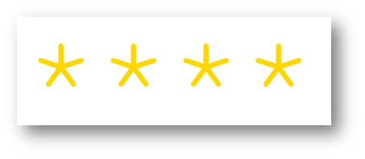

<link rel="stylesheet" href="slides.css">

# REACT #


<section class="page">

<!-- ||||||||||||||||||||||||||||||||||||||||||||||||||||||||||||| -->

<!-- todo #189 #188  -->

<article>

---

## INHALT ##

<!-- todo #1 -->

<!-- todo #2 -->

<!-- todo #3 -->

- [GETTING STARTED](#getting-started)
- [REACT PROJECT](#project)
- [CREATE-REACT-APP](#create-react-app)
- [DEBUGGING](#debugging)
- [JSX / TSX](#jsx--tsx)
- [TYPE CHECKING](#type-checking)
- [ELEMENTS](#elements)
- [COMPONENTS](#components)
- [CLASS COMPONENTS](#class-components)
- [COMPONENT STATE](#component-state)
- [COMPONENT LIFECYCLE](#component-lifecycle)
- [HOOKS](#hooks)
- [PURE COMPONENTS](#pure-components)
- [COMPOSED COMPONENTS](#composed-components)
- [APP STATE](#app-state)
- [EVENTS](#events)
<!-- - [RENDERERS](#renderers) -->
- [FORMS](#forms)
<!-- - [REFS](#refs) -->
- [CSS](#css)
- [ROUTER](#router)
- [BACKEND](#backend)
- [SSR](#ssr)
<!-- - [NATIVE](#native) -->
<!-- - [OFFLINE](#offline) -->
- [TESTING](#testing)
<!-- - [PERFORMANCE](#performance) -->
<!-- - [IS LIB](#is-library) -->
- [FABRIC UI](#fabric-ui)
<!-- - [SCHEDULER](#scheduler) -->
<!-- - [INTEGRATION](#integrating-react) -->
<!-- - [DEPLOYMENT](#deployment) -->
<!-- - [STYLE GUIDES](#style-guides) -->
- [GLOBALS](#globals)
<!-- - [IE](#ie) -->
<!-- - [FACTS](#facts) -->

</article>

</section>

<!-- ||||||||||||||||||||||||||||||||||||||||||||||||||||||||||||| -->
<!-- ||||||||||||||||||||||||||||||||||||||||||||||||||||||||||||| -->
<!-- ||||||||||||||||||||||||||||||||||||||||||||||||||||||||||||| -->
<!-- ||||||||||||||||||||||||||||||||||||||||||||||||||||||||||||| -->
<!-- ||||||||||||||||||||||||||||||||||||||||||||||||||||||||||||| -->

<section class="page">

<!-- ||||||||||||||||||||||||||||||||||||||||||||||||||||||||||||| -->

<article>

---

## GETTING STARTED ##

[REACT > IDEA](#react--idea)

[REACT > LINKS](#react--links)

[PRIMARY TOOLS](#primary-tools)

[SECONDARY TOOLS](#secondary-tools)

[GETTING STARTED > LAB](#getting-started--lab)

</article>

<!-- ||||||||||||||||||||||||||||||||||||||||||||||||||||||||||||| -->

<article>

---

### #REACT > IDEA ###

WAS IST REACT

- JS Bibliothek (unter Top 3 neben Angular and Vue.js)
- Web Framework
- SPA-Framework
- aktuelle Version 17.0.0    (20. Oktober 2020)      #checkForUpdates

WOZU IST REACT

- react - reactive - reagiert auf Änderungen im Datenmodell
- um das Umsetzen der Mutation und der Asynchronität vom UI zu erleichtern
- um das Erstellen von eigenen Web-Komponenten zu erleichtern

<!--
checkForUpdates
https://github.com/facebook/react/releases 
-->

<!-- todo #4 -->

<!-- todo #234 -->

</article>

<!-- ||||||||||||||||||||||||||||||||||||||||||||||||||||||||||||| -->

<article>

---

### REACT > LINKS ###

OFFICIAL HOMEPAGE - https://reactjs.org

OFFICIAL DOCS - https://reactjs.org/docs

OFFICIAL CODE - https://github.com/facebook/react

OFFICIAL BLOG - https://reactjs.org/blog

<!-- todo #5 -->

</article>

<!-- ||||||||||||||||||||||||||||||||||||||||||||||||||||||||||||| -->

<article>

---

### PRIMARY TOOLS ###

Entwicklungsumgebung, z.B. Visual Studio Code
- siehe vs-n-vscode > vscode > getting started

JS-Runtime, z.B. Node
- siehe node-n-npm > node > getting started

JS package manager, z.B. npm
- siehe node-n-npm > npm > getting started

CLI-Tool zum Anlegen einer App
- create-react-app

<!-- todo #6 -->

</article>

<!-- ||||||||||||||||||||||||||||||||||||||||||||||||||||||||||||| -->

<article>

---

### SECONDARY TOOLS ###

<!-- todo #235 -->

<!-- todo #236 -->

VSCODE PLUGINS

- [ES React Snippets](https://marketplace.visualstudio.com/items?itemName=dsznajder.es7-react-js-snippets)

<!-- todo #7 -->

Von React-Team empfohlen:

- [ESLint - VSCode-Intellisense for ECMAScript](https://marketplace.visualstudio.com/items?itemName=dbaeumer.vscode-eslint#overview)
- [Sublime Babel - Coloring of code like in Sublime](https://marketplace.visualstudio.com/items?itemName=joshpeng.sublime-babel-vscode)

Emmet - HTML & CSS Snippets

- für die JS-Dateien muss aktiviert werden https://code.visualstudio.com/docs/editor/emmet
(oder mit meiner Emmet settings.json vergleichen)

Prettier - Formatter https://prettier.io/

<!--
Prettier
formatting code automatically

npm install –save husky lint-staged prettier
add these fields in file package.json:
 "husky": {
    "hooks": {
      "pre-commit": "lint-staged"
    }
  },
  "lint-staged": {
     "src/**/*.{js,jsx,ts,tsx,json,css,scss,md}": [
       "prettier --single-quote --write",
       "git add"
     ]
  },
https://facebook.github.io/create-react-app/docs/setting-up-your-editor#formatting-code-automatically

**Prettier-Konfiguration**
z.B. über `.prettierrc.json`

{
bracketSpacing: false,
singleQuote: true,
trailingComma: true,
jsxBracketSameLine: true
}
-->

</article>

<!-- ||||||||||||||||||||||||||||||||||||||||||||||||||||||||||||| -->

<article>

---

### GETTING STARTED > LAB ###

<!-- todo #8 -->

</article>

<!-- ||||||||||||||||||||||||||||||||||||||||||||||||||||||||||||| -->

<article>

---

[zurück zum Ablauf]

</article>

</section>

<!-- ||||||||||||||||||||||||||||||||||||||||||||||||||||||||||||| -->
<!-- ||||||||||||||||||||||||||||||||||||||||||||||||||||||||||||| -->
<!-- ||||||||||||||||||||||||||||||||||||||||||||||||||||||||||||| -->
<!-- ||||||||||||||||||||||||||||||||||||||||||||||||||||||||||||| -->
<!-- ||||||||||||||||||||||||||||||||||||||||||||||||||||||||||||| -->

<section class="page">

<!-- ||||||||||||||||||||||||||||||||||||||||||||||||||||||||||||| -->

<article>

---

## PROJECT ##

[PROJECT ROOT](#project-root)

[PROJECT > SRC](#project--src)

[PROJECT > THIRD PARTY LIBS](#project--third-party-libs)

</article>

<!-- ||||||||||||||||||||||||||||||||||||||||||||||||||||||||||||| -->

<article>

---

### PROJECT ROOT ###

In der Root-Ebene eines frisch erstellen React-Projektes finden sich

- node_modules   - node
- public  -  react
- src   - react
- package.json    - npm
- package-lock.json   - npm

<!-- todo #9 -->

</article>

<!-- ||||||||||||||||||||||||||||||||||||||||||||||||||||||||||||| -->

<article>

---

### PROJECT > SRC ###

- App.css
- App.js
- App.test.js
- index.css
- index.js
- logo.svg
- serviceWorker.js

</article>

<!-- todo #10 -->

<!-- ||||||||||||||||||||||||||||||||||||||||||||||||||||||||||||| -->

<article>

---

### PROJECT > THIRD PARTY LIBS ###

create-react-app nutzt

- Webpack (Modul-Packer / module bundler)
  - verschiedene Lader / Loaders (css loader, svg loader, img loader)
- jsdom Bibliothek (um das DOM zu simulieren und das Runtime-Verhalten ohne Browser zu testen)
- jest (als Test Runner)

<!-- todo #11 -->

</article>

</section>

<!-- ||||||||||||||||||||||||||||||||||||||||||||||||||||||||||||| -->
<!-- ||||||||||||||||||||||||||||||||||||||||||||||||||||||||||||| -->
<!-- ||||||||||||||||||||||||||||||||||||||||||||||||||||||||||||| -->
<!-- ||||||||||||||||||||||||||||||||||||||||||||||||||||||||||||| -->
<!-- ||||||||||||||||||||||||||||||||||||||||||||||||||||||||||||| -->

<section class="page">

<!-- ||||||||||||||||||||||||||||||||||||||||||||||||||||||||||||| -->

<article>

---

## CREATE-REACT-APP ##

[#CREATE-REACT-APP > IDEA](#create-react-app--idea)

[CREATE-REACT-APP](#create-react-app)

[CREATE-REACT-APP > USAGE](#create-react-app--usage)

</article>

<!-- ||||||||||||||||||||||||||||||||||||||||||||||||||||||||||||| -->

<article>

### #CREATE-REACT-APP > IDEA ###

- CLI Utensilie zum Anlegen von React-Anwendungen mit allen Werkzeugen und Abhängigkeiten
- aktuelle Version 4.0.0 (23. Okt. 2020)   #checkForUpdates
- https://create-react-app.dev/
- https://facebook.github.io/create-react-app/
- https://github.com/facebook/create-react-app 
- https://facebook.github.io/create-react-app/docs/getting-started
- https://reactjs.org/docs/create-a-new-react-app.html
- globale Installationen vom Tool auf dem Rechner werden nicht mehr unterstützt

<!-- 
checkForUpdates
https://github.com/facebook/create-react-app/releases
 -->

</article>

<!-- ||||||||||||||||||||||||||||||||||||||||||||||||||||||||||||| -->

<article>

---

### CREATE-REACT-APP > USAGE ###

Usage: create-react-app `<project-directory> [options]`

Options:

- -V, --version                            output the version number
- --verbose                                print additional logs
- --info                                   print environment debug info
- --scripts-version `<alternative-package>`  use a non-standard version of react-scripts
- --use-npm
- --use-pnp
- --typescript
- -h, --help                               output usage information
- Only `<project-directory>` is required.

<!-- todo #12 -->

</article>

!-- ||||||||||||||||||||||||||||||||||||||||||||||||||||||||||||| -->

<article>

---

### CRA TEMPLATE ###

<!-- todo #13 -->

https://www.npmjs.com/search?q=cra-template-*

</article>

<!-- todo #14 -->

</section>

<!-- ||||||||||||||||||||||||||||||||||||||||||||||||||||||||||||| -->

<article>

---

[zurück zum Ablauf]

</article>

</section>

<!-- ||||||||||||||||||||||||||||||||||||||||||||||||||||||||||||| -->
<!-- ||||||||||||||||||||||||||||||||||||||||||||||||||||||||||||| -->
<!-- ||||||||||||||||||||||||||||||||||||||||||||||||||||||||||||| -->
<!-- ||||||||||||||||||||||||||||||||||||||||||||||||||||||||||||| -->
<!-- ||||||||||||||||||||||||||||||||||||||||||||||||||||||||||||| -->

<section class="page">

<!-- ||||||||||||||||||||||||||||||||||||||||||||||||||||||||||||| -->

<article>

---

## DEBUGGING ##

[REACT > DEBUGGING](#react--debugging)

[DEBUGGER FOR CHROME](#debugger-for-chrome)

</article>

<!-- ||||||||||||||||||||||||||||||||||||||||||||||||||||||||||||| -->

<article>

---

### REACT > DEBUGGING ###

'REACT DEVTOOLS'

- browser extension or standalone app
- https://github.com/facebook/react-devtools 
  - Anzeige der Komponententags im Inspektor
  - Anzeige von State und Props
  - Hervorhebung von Änderungen von State und Props
- https://chrome.google.com/webstore/detail/react-developer-tools/fmkadmapgofadopljbjfkapdkoienihi?hl=en
- https://addons.mozilla.org/en-US/firefox/addon/react-devtools/

<!-- todo #27 -->

</article>

<!-- ||||||||||||||||||||||||||||||||||||||||||||||||||||||||||||| -->

<article>

---

### DEBUGGER FOR CHROME ###

Debugger for Chrome ist eine VSCode Erweiterung

Anleitung:

- create folder .vscode in the app-root
- create file launch.json in this folder

```json
{
  "version": "0.2.0",
  "configurations": [
    {
      "name": "Chrome",
      "type": "chrome",
      "request": "launch",
      "url": "http://localhost:3000",
      "webRoot": "${workspaceFolder}/src",
      "sourceMapPathOverrides": {
        "webpack:///src/*": "${webRoot}/*"
      }
    }
  ]
}
```

<!-- todo #28 -->

</article>

<!-- ||||||||||||||||||||||||||||||||||||||||||||||||||||||||||||| -->

<article>

---

[zurück zum Ablauf]

</article>

</section>

<!-- ||||||||||||||||||||||||||||||||||||||||||||||||||||||||||||| -->
<!-- ||||||||||||||||||||||||||||||||||||||||||||||||||||||||||||| -->
<!-- ||||||||||||||||||||||||||||||||||||||||||||||||||||||||||||| -->
<!-- ||||||||||||||||||||||||||||||||||||||||||||||||||||||||||||| -->
<!-- ||||||||||||||||||||||||||||||||||||||||||||||||||||||||||||| -->

<section class="page">

<!-- ||||||||||||||||||||||||||||||||||||||||||||||||||||||||||||| -->

<article>

---

## JSX / TSX ##

[#JSX > IDEA](#jsx--idea)

[JSX > INTEGRATION](#jsx--integration)

[JSX > MANY ELEMENTS](#jsx--many-elements)

[JSX > BOOLEAN](#jsx--boolean)

[JSX > REACT.CREATEELEMENT()](#jsx--reactcreateelement)

[JSX > LAB](#jsx--lab)

[JSX > ELEMENT ATTRIBUTES](#jsx--element-attributes)

[JSX > JS EXPRESSIONS](#jsx--js-expressions)

[JSX > CLASS NAME](#jsx--class-name)

[JSX > ATTRIBUTES](#jsx--attributes)

[JSX > CONDITIONALS](#jsx--conditionals)

[JSX > ITERATING](#jsx--iterating)

[JSX > LAB 2](#jsx--lab-2)

</article>

<!-- ||||||||||||||||||||||||||||||||||||||||||||||||||||||||||||| -->

<article>

---

### #JSX > IDEA ###

WAS IST JSX

- JSX = JS + XML
- JSX = default Templatesprache von React (kann sein, muss aber nicht)
  - < wechselt von JS zu XML/HTML
  - { wechselt von XML/HTML zurück zu JS
- wenn JSX, dann Babel
  - https://babeljs.io/repl/#?presets=react&code_lz=MYewdgzgLgBApgGzgWzmWBeGAeAFgRgD4AJRBEAGhgHcQAnBAEwEJsB6AwgbgChRJY_KAEMAlmDh0YWRiGABXVOgB0AczhQAokiVQAQgE8AkowAUAcjogQUcwEpeAJTjDgUACIB5ALLK6aRklTRBQ0KCohMQk6Bx4gA

```js
function JSXExpression() {
  return <h1>Hallo Welt, ich bin {2019 - 1984} Jahre alt.</h1>;
}
```

<!-- todo #29 -->

</article>

<!-- ||||||||||||||||||||||||||||||||||||||||||||||||||||||||||||| -->

<article>

---

### JSX > INTEGRATION ###

REACT & JSX zum fertigen Projekt hinzufügen

```powershell
npm init –y
npm install babel-cli@6 babel-preset-react-app@3
new-item src –itemtype directory
npx babel --watch src --out-dir . --presets react-app/prod
```

</article>

<!-- todo #30 -->

<!-- todo #31 -->

<!-- ||||||||||||||||||||||||||||||||||||||||||||||||||||||||||||| -->

<article>

---

### JSX > MANY ELEMENTS ###

Mehrere Elemente in der gleichen Ebene sollen von einem Container-Element umgeschlossen werden

```jsx
function JSXManyEls() {
  return (
    <header>
      <h1>Hallo Welt!</h1>
      <p>Ich bin {2019 - 1984} Jahre alt.</p>
    </header>
  );
}
```

<!-- todo #32 -->

Grundsätzlich können wir über Arrays mehrere Elemente einbinden

```jsx
let liArr = [<li>1</li>, <li>2</li>]
// [...]
return (
<ul>
 {liArr}
</ul>
)
```

</article>

<!-- ||||||||||||||||||||||||||||||||||||||||||||||||||||||||||||| -->

<article>

---

### JSX > BOOLEAN ###

{js_boolean_expression}

Booleans werden nicht gerendert

```jsx
function JSXRendersNoBoolean() {
  let isWinter = false;
  return (
    <header>
      <h1>Hallo Welt!</h1>
      <p>Ich bin {2019 - 1984} Jahre alt.</p>
      <p>Ist jetzt Winter? - {isWinter}!</p>
    </header>
  );
}
```

<!-- todo #33 -->

</article>

<!-- ||||||||||||||||||||||||||||||||||||||||||||||||||||||||||||| -->

<article>

---

### JSX > REACT.CREATEELEMENT() ###

JSX Elemente sind JS Objekte

```jsx
function JSXElsAreObjects() {  
  let el = (
    <header>
      <h1>Hallo Welt!</h1>
      <p>Ich bin {2019 - 1984} Jahre alt.</p>     
    </header>
  );
  // return el;
  return typeof el;
}
```

In den geschweiften Klammern sind keine JS-/TS-Objekte erlaubt

```jsx
 <p>Heute ist: {new Date()}</p> // geht nicht
 <p>Heute ist: {datumString}</p> // geht, wenn man datum zum String umwandelt
```
<!-- todo #1 -->

<!-- todo #34 -->

</article>

<!-- ||||||||||||||||||||||||||||||||||||||||||||||||||||||||||||| -->

<article>

---

### JSX > LAB ###

Demo theory-app

- legen Sie den Ordner 'm00outOfTheBox' an und fügen Sie die kopierten Dateien aus 'workmodule' da hinein
- machen Sie mit JSX im 'workmodule' weiter
  
Übung todo-app version20

- kopieren Sie alle Dateien aus version10 nach version20
- nehmen Sie die App-Komponente aus version20 in index.js
- (bei weiteren Übungen (Versionen) machen Sie diese zwei Schritte als Erstes)
- zeigen Sie das aktuelle Datum (keine Uhrzeit) im Greeter in einem zweiten Absatz (Paragrafen)

<!-- todo #35 -->

</article>

<!-- ||||||||||||||||||||||||||||||||||||||||||||||||||||||||||||| -->

<article>

---

### JSX > JS EXPRESSIONS ###

Zeichenketten werden in den Hochkommata geschrieben. Einfachen oder doppelten.

Zahlen, Booleans, JS-Ausdrücke werden in den geschweiften Klammern geschrieben.

```jsx

// ---------------------------------------------------
let picUrl ='https://picsum.photos/300/200/?random';
let rArr = [1,2,3];
// ...

```

<!-- todo #36 -->

</article>

<!-- ||||||||||||||||||||||||||||||||||||||||||||||||||||||||||||| -->

<article>

---

### JSX > CLASS NAME ###

Manche HTML-Attribute haben bei React eine Alternative

class => className

```jsx
// +++ Helloworld.css
.big { font-size: 2em; }
.small { font-size: .7em; }

// *** Helloworld.js
<p className="big">Ich habe unterschiedliche Hobbys:</p>
```

<!-- todo #37 -->

CSS Klassen sind im Allgemeinen für die Performance besser als Inline-Stile

```jsx
<div className={getClassName()}>
// [...]
</div>
<div style={{
color: '#fff',
fontSize: getFontSize()
}}>
</div>
```

<!-- todo #38 -->

</article>

<!-- ||||||||||||||||||||||||||||||||||||||||||||||||||||||||||||| -->

<article>

---

### JSX > ATTRIBUTES ###

Generell gilt die Regel: React-Versionen von HTML-Attributen werden in 'camelCase' geschrieben

- class => className
- tabindex => tabIndex

```jsx
const element = <div tabIndex="0"></div>;
```

</article>

<!-- todo #39 -->

<!-- todo #40 -->

<!-- ||||||||||||||||||||||||||||||||||||||||||||||||||||||||||||| -->

<article>

---

### JSX > CONDITIONALS ###

- ja:  conditional expression
- nein:  if-statement

```jsx
<div>
  {Math.random() > 0.5 ? 'heads' : 'tails'}
</div>
```

<!-- todo #41 -->

Alternative - eine Funktion mit if-Abfrage

```jsx
function coinToss() {
 if (Math.random() > 0.5) {return 'heads';}
 else {return 'tails';}
}
// [...]
<div>
 {coinToss()}
</div>
```

<!--
coin toss - Münzwurf
Kopf & Zahl
 -->

</article>

<!-- ||||||||||||||||||||||||||||||||||||||||||||||||||||||||||||| -->

<article>

---

### JSX > ITERATING ###

Meist verwendet man zum Iterieren die .map() - Methode

```jsx
let todos = ['groceries', 'cooking', 'gardening'];
let list = (
<ul>
  {this.state.todos.map(todo => (
   <li>{todo}</li>
  ))}
 </ul>
);
```

- Bei obigem Code: Warnung in der Browser-Konsole
- Lösung: key (als string):

```jsx
let todos = [ { description: 'groceries', id: 0 }, ... ];
let list = <ul>
 {
  todos.map(todo => (
   <li key={todo.id.toString()}>{todo.description}</li>
  ))
 }
</ul>
```

<!-- todo #43 -->

<!-- todo #42 -->

</article>

<!-- ||||||||||||||||||||||||||||||||||||||||||||||||||||||||||||| -->

<article>

---

### JSX > LAB 2 ###

Demo theory-app

- module40

Übung todo-app version40

- create the Todo-Component with an array of 3 objects (todos)
- each object has properties id (number), title (string) and done (boolean)
- show these todos in a list
- if done is true, then todo is crossed out (text-decoration: line-through)

<!-- Zeige eine zufällige Roulettezahl an (0-36) -->

</article>

<!-- ||||||||||||||||||||||||||||||||||||||||||||||||||||||||||||| -->

<article>

---

[zurück zum Ablauf]

</article>

</section>

<!-- ||||||||||||||||||||||||||||||||||||||||||||||||||||||||||||| -->
<!-- ||||||||||||||||||||||||||||||||||||||||||||||||||||||||||||| -->
<!-- ||||||||||||||||||||||||||||||||||||||||||||||||||||||||||||| -->
<!-- ||||||||||||||||||||||||||||||||||||||||||||||||||||||||||||| -->
<!-- ||||||||||||||||||||||||||||||||||||||||||||||||||||||||||||| -->

<section class="page">

<!-- ||||||||||||||||||||||||||||||||||||||||||||||||||||||||||||| -->

<article>

---

## TYPE CHECKING ##

[TYPE CHECKING > INTRO](#type-checking--intro)

[TYPE CHECKING > TYPESCIRPT](#type-checking--typescirpt)

[TYPE CHECKING > PROP TYPES](#type-checking--prop-types)

[TYPE CHECKING > FLOW](#type-checking--flow)

</article>

<!-- ||||||||||||||||||||||||||||||||||||||||||||||||||||||||||||| -->

<article>

---

### TYPE CHECKING > INTRO ###

React mit JSX ist auf JS aufgebaut. JS-Datentypen sind dynamisch, es gibt keine strenge Typ-Prüfung.

Will man das doch haben, kann man eine von diesen Technologien benutzen:

- React mit TypeScript
- React Bibliothek PropTypes
- Drittanbieter Bibliothek Flow

<!-- todo #46 -->

</article>

<!-- ||||||||||||||||||||||||||||||||||||||||||||||||||||||||||||| -->

<article>

---

### TYPE CHECKING > TYPESCIRPT ###

create-react-app verfügt über ein Template mit TypeScript

```bash
npx create-react-app <app-name> --template typescript
```

<!-- todo #48 -->

</article>

<!-- ||||||||||||||||||||||||||||||||||||||||||||||||||||||||||||| -->

<article>

---

### TYPE CHECKING > PROP TYPES ###

PROPERTIES

- PropTypes.any
- PropTypes.array
- PropTypes.bool
- PropTypes.element
- PropTypes.elementType
- PropTypes.func
- PropTypes.node
- PropTypes.nominalTypeHack
- PropTypes.number
- PropTypes.object
- PropTypes.string
- PropTypes.symbol

<!--
NODE
Anything that can be rendered: numbers, strings, elements or an array (or fragment) containing these types.
-->

METHODS

- PropTypes.arrayOf()
- PropTypes.checkPropTypes()
- PropTypes.exact()
- PropTypes.instanceOf()
- PropTypes.objectOf()
- PropTypes.oneOf()
- PropTypes.oneOfType()
- PropTypes.resetWarningCache
- PropTypes.shape()

<!-- todo #47 -->

</article>

<!-- ||||||||||||||||||||||||||||||||||||||||||||||||||||||||||||| -->

<article>

---

### TYPE CHECKING > FLOW ###

- https://flow.org/
- https://flow.org/en/docs/getting-started/

</article>

<!-- ||||||||||||||||||||||||||||||||||||||||||||||||||||||||||||| -->

<article>

---

[zurück zum Ablauf]

</article>

</section>

<!-- ||||||||||||||||||||||||||||||||||||||||||||||||||||||||||||| -->
<!-- ||||||||||||||||||||||||||||||||||||||||||||||||||||||||||||| -->
<!-- ||||||||||||||||||||||||||||||||||||||||||||||||||||||||||||| -->
<!-- ||||||||||||||||||||||||||||||||||||||||||||||||||||||||||||| -->
<!-- ||||||||||||||||||||||||||||||||||||||||||||||||||||||||||||| -->

<section class="page">

<!-- ||||||||||||||||||||||||||||||||||||||||||||||||||||||||||||| -->

<article>

---

## ELEMENTS ##

[#ELEMENTS > IDEA](#elements--idea)

[CREATING ELEMENTS](#creating-elements)

[FRAGMENT](#fragment)

[TRANSFORMING ELEMENTS](#transforming-elements)

[CHILDREN](#children)

[ELEMENTS > LAB](#ecosystem--lab)

</article>

<!-- ||||||||||||||||||||||||||||||||||||||||||||||||||||||||||||| -->

<article>

---

### #ELEMENTS > IDEA ###

 `#react-element` `#element`

- React Elemente (Rückgabewert der Funktion React.createElement()) sind ähnlich zu HTML Elementen (h1, p, a, button etc.)
- JS Objekte (immutable objects)
- sind leichter, als DOM-Elemente -> Performance

```jsx
const element = <p>ein über jsx angelegtes react element</p>
```

<!-- todo #49 -->

<!-- todo #185 -->

<!-- todo #44 -->

<!-- todo #186 -->

<!-- todo #45 -->

</article>

<!-- ||||||||||||||||||||||||||||||||||||||||||||||||||||||||||||| -->

<article>

---

### CREATING ELEMENTS ###

Option 1

- JSX

Option 2

- React.createElement()

<!-- todo #50 -->

Rückgabewert von `React.createElement()` ist `React.ReactElement`

```jsx
const par = React.createElement(
  'p',
  {class: 'big'},
  'par text')
```

<!-- todo #51 -->

</article>

<!-- todo #52 -->

<!-- ||||||||||||||||||||||||||||||||||||||||||||||||||||||||||||| -->

<article>

---

### FRAGMENT ###

- Fragment erlaubt, in render() oder return() mehrere Elemente anzugeben, ohne sie in ein zusätzliches Elternelement umschließen zu sollen
- Fragment rendert keine sichtbare UI-Elemente

<!-- todo #53 -->

</article>

<!-- todo #54 -->

<!-- ||||||||||||||||||||||||||||||||||||||||||||||||||||||||||||| -->

<article>

---

### TRANSFORMING ELEMENTS ###

- React.cloneElement()
- React.isValidElement()
- React.Children

<!-- todo #55 -->

</article>

<!-- ||||||||||||||||||||||||||||||||||||||||||||||||||||||||||||| -->

<article>

---

### CHILDREN ###

liefert Utensilien zum Arbeiten mit der opaken (undurchsichtigen) Datenstruktur von this.props.children

- React.Children.map()
- React.Children.forEach()
- React.Children.count()
- React.Children.only()
- React.Children.toArray()

<!-- todo #56 -->

</article>

<!-- ||||||||||||||||||||||||||||||||||||||||||||||||||||||||||||| -->

<article>

---

### ELEMENTS > LAB ###

module Elements

</article>

<!-- ||||||||||||||||||||||||||||||||||||||||||||||||||||||||||||| -->

<article>

---

[zurück zum Ablauf]

</article>

</section>

<!-- ||||||||||||||||||||||||||||||||||||||||||||||||||||||||||||| -->
<!-- ||||||||||||||||||||||||||||||||||||||||||||||||||||||||||||| -->
<!-- ||||||||||||||||||||||||||||||||||||||||||||||||||||||||||||| -->
<!-- ||||||||||||||||||||||||||||||||||||||||||||||||||||||||||||| -->
<!-- ||||||||||||||||||||||||||||||||||||||||||||||||||||||||||||| -->

<section class="page">

<!-- ||||||||||||||||||||||||||||||||||||||||||||||||||||||||||||| -->

<article>

---

## COMPONENTS ##

[#COMPONENTS > IDEA](#components--idea)

[COMPONENTS > PROPS](#components--props)

[COMPONENTS > DEMO](#components--demo)

</article>

<!-- ||||||||||||||||||||||||||||||||||||||||||||||||||||||||||||| -->

<article>

---

### #COMPONENTS > IDEA ###

`#component` `#react-component`

- ähnlich wie Web Components - selbst definierte HTML tags
- Konvention: sollten mit großem Buchstaben starten (PascalCase)
- können entweder als Funktionen oder als Klassen definiert werden
- haben immer props
  - als Argument (bei Funktionen) oder
  - als Eigenschaft (bei Klassen)

```jsx
<Rating stars={4}/>
```



<!-- todo #57 -->

</article>

<!-- todo #58 -->

<!-- ||||||||||||||||||||||||||||||||||||||||||||||||||||||||||||| -->

<article>

---

### COMPONENTS AS FUNCTION ###

function components (funktionale Komponenten)

- sind einfacher zu definieren (kein Konstruktor, keine Methoden-Probleme)

- JS-Bemerkung1: Funktionen in Funktionen sind ok!
- JS-Bemerkung2: Variablen, die als Wert Funktionen haben, sind ok!
- JS-Bemerkung3: Variablen, die als Wert Pfeilfunktionen beinhalten, sind der Hammer!

</article>

<!-- ||||||||||||||||||||||||||||||||||||||||||||||||||||||||||||| -->

<article>

---

### COMPONENTS > PROPS ###

React.Component.props

- props ist ein JS-Objekt
- read-only
- kommt zur Komponente von ihrer Elternkomponenten (oder von der aufrufenden Stelle, wenn es keine Eltern gibt)
- darf bei funktionalen Komponenten auch anders heißen

```jsx
function Rating(props) {
  return (
    <div className="rating">
      {'*'.repeat(props.numberOfStars)}
    </div>
  );
}
```

<!-- todo #59 -->

</article>

<!-- todo #60 -->

<!-- todo #61 -->

<!-- ||||||||||||||||||||||||||||||||||||||||||||||||||||||||||||| -->

<article>

---

### COMPONENTS > DEMO ###

Demo theory-app

- module30
- myComponent
- myCompWProps

Übung todo-app version30

- Ihr Name kommt in die Greeter-Komponente über props rein
- zeigen Sie das Datum im Greeter über eine neue Komponenten (DateTime.js)
- legen Sie eine neue Komponenten Rating an, die Sterne rendert. Anzahl von Sternen wird in der Elternkomponenten definiert. Rating-Komponente wird über App gerendert.

<!-- todo #62 -->

</article>

</section>

<!-- ||||||||||||||||||||||||||||||||||||||||||||||||||||||||||||| -->
<!-- ||||||||||||||||||||||||||||||||||||||||||||||||||||||||||||| -->
<!-- ||||||||||||||||||||||||||||||||||||||||||||||||||||||||||||| -->
<!-- ||||||||||||||||||||||||||||||||||||||||||||||||||||||||||||| -->
<!-- ||||||||||||||||||||||||||||||||||||||||||||||||||||||||||||| -->

<section class="page">

<!-- ||||||||||||||||||||||||||||||||||||||||||||||||||||||||||||| -->

<article>

---

## CLASS COMPONENTS ##

[#CLASS-COMPONENT > IDEA](#class-component--idea)

[COMPONENT CLASS](#component-class)

[CLASS COMPONENT > METHODS](#class-component--methods)

</article>

<!-- ||||||||||||||||||||||||||||||||||||||||||||||||||||||||||||| -->

<article>

---

### #CLASS-COMPONENT > IDEA ###

Klassenkomponenten erben von der Klasse `React.Component`

```jsx
// +++ Rating.js
import React, { Component } from 'react';
export class Rating extends Component {
  render() {
    return (
      <div className="rating">
        {'*'.repeat(this.props.stars)}
      </div>
    );
  }
}
// *** App.js
<Rating stars="4"/>
```

<!-- todo #66 -->

<!-- todo #67 -->

<!-- todo #68 -->

</article>

<!-- ||||||||||||||||||||||||||||||||||||||||||||||||||||||||||||| -->

<article>

---

### COMPONENT CLASS ###

Von Entwicklern angelegte Klassenkomponenten erben von der Klasse Component.

Eigenschaften von Component:

- props
- state

Methoden von Component:

- render()
- setState()

TypeScript-Intellisense in VSCode zeigt zu Component Folgendes:

```jsx
class React.Component<P = {}, S = {}, SS = any>
// P - props
// S - state
// SS - snapshot
```

<!-- todo #65 -->

</article>

<!-- ||||||||||||||||||||||||||||||||||||||||||||||||||||||||||||| -->

<article>

---

### CLASS COMPONENT > METHODS ###

- Methoden der Klasse sollte man mit einer Pfeilfunktion nutzen (z.B. onIncrement = () => ...)
- auf diese Weise vermeidet man die Probleme mit dem verwaisten Gebrauch von this

<!-- todo #69 -->

</article>

</section>

<!-- ||||||||||||||||||||||||||||||||||||||||||||||||||||||||||||| -->
<!-- ||||||||||||||||||||||||||||||||||||||||||||||||||||||||||||| -->
<!-- ||||||||||||||||||||||||||||||||||||||||||||||||||||||||||||| -->
<!-- ||||||||||||||||||||||||||||||||||||||||||||||||||||||||||||| -->
<!-- ||||||||||||||||||||||||||||||||||||||||||||||||||||||||||||| -->

<section class="page">

<!-- ||||||||||||||||||||||||||||||||||||||||||||||||||||||||||||| -->

<article>

---

## COMPONENT STATE ##

[#COMPONENT-STATE > IDEA](#component-state--idea)

[CHANGING STATE IN CLASS COMPONENTS](#changing-state-in-class-components)

[CLASS COMPONENT > CONSTRUCTOR](#class-component--constructor)

[CLASS COMPONENT STATE & RENDER](#class-component-state--render)

[CLASS COMPONENT STATE > LAB](#class-component-state--lab)

</article>

<!-- ||||||||||||||||||||||||||||||||||||||||||||||||||||||||||||| -->

<article>

---

### #COMPONENT-STATE > IDEA ###

WAS IST COMPONENT STATE

- generell: Daten, die nicht durch Props in die Komponente kommen
- z.B. Eingabe vom Benutzer
- z.B. Daten aus einer Datenbank oder einer Web REST-API

WOZU IST COMPONENT STATE

- State braucht man, wenn irgendwelche Objekte / Variablen sich unabhängig von der Elternkomponente ändern sollen
- gutes Beispiel - interaktive Komponenten

STATE & PROPS

- Props = vom Elternelement übergebene Parameter
- State = interner Zustand einer Komponente
- State ist privat, Props nicht
- State ist änderbar, Props ist read-only

- Theoretisches Beispiel - input-Komponente

  - type, maxLength => props
  - value => state

<!-- todo #72 -->

<!-- todo #73 -->

</article>

<!-- ||||||||||||||||||||||||||||||||||||||||||||||||||||||||||||| -->

<article>

---

### CHANGING STATE IN CLASS COMPONENTS ###

- nicht primitive Strukturen (Arrays, Objekte) sollten ohne Mutation geändert werden
- Wir übergeben der setState-Methode eine callback-Funktion, die den alten Zustand in den neuen überführt

```jsx
this.state
this.setState({key: value});
```

```jsx
// löschen eines Todos
 this.setState(oldState => {
  let newTodos = oldState.todos.slice();
  newTodos.pop();
  return { todos: newTodos };
 });
```

<!-- todo #75 -->

</article>

<!-- ||||||||||||||||||||||||||||||||||||||||||||||||||||||||||||| -->

<article>

---

### CLASS COMPONENT > CONSTRUCTOR ###

- normalerweise nur in zwei Fällen:
  - den lokalen Zustand über this.state = {…} zu initialisieren
  - Event-Handler-Methoden an die Klasseninstanz zu binden
- Konstruktor ist die einzige Stelle für this.state = {…}. Sonst setState()
- Wenn Konstruktor gebraucht wird, dann immer mit Verweis auf Elternkonstruktor - super()

<!-- todo #70 -->

```jsx
+++ TodosComponent.js
import React, { Component } from 'react';
export class TodosComponent extends Component {
  constructor(props) {
    super(props);
    this.state = {
      loggedIn: true,
      todos: ['laundry', 'groceries', 'taxes']
    }
  }
}
```

<!-- todo #71 -->

</article>

<!-- ||||||||||||||||||||||||||||||||||||||||||||||||||||||||||||| -->

<article>

---

### CLASS COMPONENT STATE & RENDER ###

- setState() ändert den Zustand und ruft gleich intern die render-Methode neu auf. Dadurch aktualisieren sich die Daten aus dem State im Template automatisch

bei Klassenkomponenten obligatorisch

```jsx
// ! keine setState()-Methode innerhalb von render() !
render() {
 return (
  <div>
   <h2>Nr1 Aufgabe für heute</h2>
   <p>{this.state.todos[0]}</p>
  </div>
 )
}
```

<!-- todo #74 -->

</article>

<!-- ||||||||||||||||||||||||||||||||||||||||||||||||||||||||||||| -->

<article>

---

### CLASS COMPONENT STATE > LAB ###

demo theory-app

- module50

exercise todo-app - version50

- DateTime Komponente
  - Variable date in DateTime übergeht in den State
  - zeigen Sie nicht nur Datum, sondern auch die Uhrzeit vom Date-Objekt
  - die Uhrzeit sollte sich jede Sekunde aktualisieren
- Todo Komponente
  - Array todos sollte im State aufbewahrt werden

<!-- todo #76 -->

</article>

<!-- todo #77 -->

</section>

<!-- ||||||||||||||||||||||||||||||||||||||||||||||||||||||||||||| -->
<!-- ||||||||||||||||||||||||||||||||||||||||||||||||||||||||||||| -->
<!-- ||||||||||||||||||||||||||||||||||||||||||||||||||||||||||||| -->
<!-- ||||||||||||||||||||||||||||||||||||||||||||||||||||||||||||| -->
<!-- ||||||||||||||||||||||||||||||||||||||||||||||||||||||||||||| -->

<section class="page">

<!-- ||||||||||||||||||||||||||||||||||||||||||||||||||||||||||||| -->

<article>

---

## COMPONENT LIFECYCLE ##

[#LIFECYCLE > IDEA](#lifecycle--idea)

[LIFECYCLE EVENTS & METHODS](#lifecycle-events--methods)

[SHOULD COMPONENT UPDATE](#should-component-update)

[COMPONENT LIFECYCLE > DEMO](#component-lifecycle--demo)

</article>

<!-- ||||||||||||||||||||||||||||||||||||||||||||||||||||||||||||| -->

<article>

---

### #LIFECYCLE > IDEA ###

- Lebenzyklus einer Komponente hat mehrere Etappen
  - im DOM initialisieren…
  - aktualisieren…
  - aus dem DOM löschen…
- dieses Konzept hat in React zwei Realisierungsmöglichkeiten
  - Lebenszyklusmethoden bei Klassenkomponentene (dieses Modul)
  - Hook bei Funktionskomponenten (siehe REACT > HOOKS > USEEFFECT)

</article>

<!-- ||||||||||||||||||||||||||||||||||||||||||||||||||||||||||||| -->

<article>

---

### LIFECYCLE EVENTS & METHODS ###

Lebenszyklus-Ereignisse

- mounting
  - Komponente wird gerendert zum ersten Mal
- unmounting
  - Komponente (und deren Kinder) werden aus DOM gelöscht

Lebenszyklus-Methoden in Klassenkomponenten

- componentDidMount() {}
- componentWillUnmount() {}

<!-- todo #78 -->

</article>

<!-- ||||||||||||||||||||||||||||||||||||||||||||||||||||||||||||| -->

<article>

---

### SHOULD COMPONENT UPDATE ###

- In einer Komponente kann shouldComponentUpdate() neu implementiert werden
- Damit kann das Rerendering noch genauer gesteuert werden

<!-- todo #79 -->

</article>

<!-- todo #80 -->

<!-- ||||||||||||||||||||||||||||||||||||||||||||||||||||||||||||| -->

<article>

---

### COMPONENT LIFECYCLE > DEMO ###

demo theory-app
- module60
exercise todo-app - version60
- DateTime-Komponente
  - in module50 ist setTimeout eingesetzt und absichtlich ein loop zwischen render und setState() angelegt
  - setTimeout muss durch setInterval ersetzt werden und die Komponente muss entsprechend angepasst werden
  - componentDidMount, componentWillUnmount
- Todos-Komponente
  - es soll die Möglichkeit geben, neue Todos über ein Input-Feld einzugeben
  - bei componentDidUpdate kommt eine Meldung in der window.console

<!-- todo #81 -->

</article>

<!-- todo #82 -->

<!-- todo #83 -->

</section>

<!-- ||||||||||||||||||||||||||||||||||||||||||||||||||||||||||||| -->
<!-- ||||||||||||||||||||||||||||||||||||||||||||||||||||||||||||| -->
<!-- ||||||||||||||||||||||||||||||||||||||||||||||||||||||||||||| -->
<!-- ||||||||||||||||||||||||||||||||||||||||||||||||||||||||||||| -->
<!-- ||||||||||||||||||||||||||||||||||||||||||||||||||||||||||||| -->

<section class="page">

<!-- ||||||||||||||||||||||||||||||||||||||||||||||||||||||||||||| -->

<article>

---

## HOOKS ##

[#HOOKS > IDEA](#hooks--idea)

[USE STATE](#use-state)

[USE EFFECT](#use-effect)

[USE EFFECT > CLEANING UP](#use-effect--cleaning-up)

</article>

<!-- ||||||||||||||||||||||||||||||||||||||||||||||||||||||||||||| -->

<article>

---

### #HOOKS > IDEA ###

WAS SIND REACT HOOKS

- Funktionen

WOZU SIND REACT HOOKS

- machen State und Lebenszyklusmethoden ohne Klassen möglich (sprich: für die funktionale Komponenten)
- Hooks nur in der Topebene benutzen (nicht innerhalb von Schleifen, Konditionenabfragen oder eingebauten Funktionen)
- nur innerhalb von Funktionenkomponenten (nicht innerhalb von normalen JS-Funktionen)

<!-- todo #85 -->

</article>

<!-- ||||||||||||||||||||||||||||||||||||||||||||||||||||||||||||| -->

<article>

---

### USE STATE ###

- Funktionale Komponenten konnten keinen State haben
- seit React #v.16.8+ können Funktion-Komponenten auch State mit Hilfe von Hooks haben (useState hook)

<!-- todo #63 -->

- initialValue kann ein primitiver Datentyp oder ein Objekt sein
- mehrere useState in derselben Komponente möglich
- useState gibt ein Array aus zwei Elementen zurück
  - das zweite Element ist eine Funktion

```jsx
const [stateVar, setStateFct] = useState(initialValue);
```

<!-- todo #86 -->

</article>

<!-- todo #87 -->

<!-- ||||||||||||||||||||||||||||||||||||||||||||||||||||||||||||| -->

<article>

---

### USE EFFECT ###

- Funktionale Komponenten konnten keine Lifecycle Hooks nutzen
- jetzt: useEffect()

<!-- todo #64 -->

Äquivalent zu Lifecycle Methods (

- componentDidMount,
- componentDidUpdate, and
- componentWillUnmount in React classes)

<!-- todo #88 -->

</article>

<!-- ||||||||||||||||||||||||||||||||||||||||||||||||||||||||||||| -->

<article>

---

### USE EFFECT > CLEANING UP ###

analog zu componentWillUnmount()

```jsx
useEffect(() => {
 methodAfterMounting();
 return () => {
  methodBeforeUnmounting();
 };
});
```

<!-- todo #89 -->

</article>

<!-- todo #90 -->

<!-- todo #91 -->

<!-- ||||||||||||||||||||||||||||||||||||||||||||||||||||||||||||| -->

<article>

---

[zurück zum Ablauf]

</article>

</section>

<!-- ||||||||||||||||||||||||||||||||||||||||||||||||||||||||||||| -->
<!-- ||||||||||||||||||||||||||||||||||||||||||||||||||||||||||||| -->
<!-- ||||||||||||||||||||||||||||||||||||||||||||||||||||||||||||| -->
<!-- ||||||||||||||||||||||||||||||||||||||||||||||||||||||||||||| -->
<!-- ||||||||||||||||||||||||||||||||||||||||||||||||||||||||||||| -->

<section class="page">

<!-- ||||||||||||||||||||||||||||||||||||||||||||||||||||||||||||| -->

<article>

---

## PURE COMPONENTS ##

[#PURE-COMPONENT > IDEA](#pure-component--idea)

[PURE COMPONENT > MUTATION](#pure-component--mutation)

</article>

<!-- ||||||||||||||||||||||||||||||||||||||||||||||||||||||||||||| -->

<article>

---

### #PURE-COMPONENT > IDEA ###

- Zur Performanceoptimierung
- Statt von Component können wir von PureComponent erben
- Die Entsprechende Komponente wird nur neu gerendert, wenn sich entweder state oder props geändert haben

- Change Detection
- In einer PureComponent gelten Einträge in state bzw props dann als geändert, wenn sie sich auf ein anderes Objekt als zuvor beziehen
  
<!-- todo #84 -->

</article>

<!-- ||||||||||||||||||||||||||||||||||||||||||||||||||||||||||||| -->

<article>

---

### PURE COMPONENT > MUTATION ###

- Datenverwaltung ohne Mutationen
- Wichtig bei PureComponent: Objekte, die Daten enthalten, dürfen nicht direkt abgeändert werden
- Stattdessen werden diese Objekte durch neue, abgeänderte Objekte ersetzt

<!-- 
PREPARATION REMARKS

bei Arrays - spread-Operator (...) oder slice()-Methode
bei Objects - assign()
-->

Datenverwaltung ohne Mutationen: Arrays

```jsx
let names = ['Alice', 'Bob', 'Charlie'];
// names.push('Dan'); // nicht zulässig: verändert das ursprüngliche array
let newNames = names.slice(); // stattdessen: neues Array;
newNames.push('Dan');
names = newNames; // überschreiben des ursprünglichen Arrays
// names = [...names, 'Dan']; // Alternative
```

Datenverwaltung ohne Mutationen: Objekt

```jsx
let user = {
  name: 'john'
  email: 'john@doe.com'
}
// nicht zulässig: verändert das Objekt
user.email = 'johndoe@gmail.com';

// mit moderner Syntax (ab ES2018):
let newUser = { ...user, email: 'johndoe@gmail.com' };
```

</article>

</section>

<!-- ||||||||||||||||||||||||||||||||||||||||||||||||||||||||||||| -->
<!-- ||||||||||||||||||||||||||||||||||||||||||||||||||||||||||||| -->
<!-- ||||||||||||||||||||||||||||||||||||||||||||||||||||||||||||| -->
<!-- ||||||||||||||||||||||||||||||||||||||||||||||||||||||||||||| -->
<!-- ||||||||||||||||||||||||||||||||||||||||||||||||||||||||||||| -->

<section class="page">

<!-- ||||||||||||||||||||||||||||||||||||||||||||||||||||||||||||| -->

<article>

---

## COMPOSED COMPONENTS ##

[#COMPOSED-COMPONENTS > IDEA](#composed-components--idea)

[LIFTING STATE UP](#lifting-state-up)

[LIFTING STATE UP > LAB](#lifting-state-up--lab)

[PROPS CHILDREN > LAB](#props-children--lab)

[COMPONENTS AS PROPS > LAB](#components-as-props--lab)

[SPECIALIZATION > LAB](#specialization--lab)

[COMPONENTS IN STATE > LAB](#components-in-state--lab)

</article>

<!-- ||||||||||||||||||||||||||||||||||||||||||||||||||||||||||||| -->

<article>

---

### #COMPOSED-COMPONENTS > IDEA ###

Die Komponenten werden normalerweise verschachtelt. Sie werden nicht nur nebeneinander (Geschwister-Beziehung), sondern auch ineinander (Eltern-Kind- / Vorfahr-Nachfahr-Beziehung) verwendet.

Beim Aufbau von solchen Hierarchien und Kapselungen wird darauf geachtet, welche Komponenten auf welche Daten zugreifen sollen.

</article>

<!-- ||||||||||||||||||||||||||||||||||||||||||||||||||||||||||||| -->

<article>

---

### LIFTING STATE UP ###

oder: Teilen vom State unter mehreren Komponenten

- wann soll State geteilt werden?:
  - zwei oder mehrere Komponenten sollen synchronisiert werden, sie hängen vom gleichen Datensatz ab
- Platz für den geteilten State - die erste gemeinsame Elternkomponente

<!-- todo #93 -->

- wie benachrichtigen die Kindkomponenten ihre Elternkomponenten über eigene Datenänderungen?
- Datenfluss
  - parent → child: props
  - child → parent: events

<!-- todo #94 -->

</article>

<!-- todo #92 -->

<!-- todo #95 -->

<!-- todo #97 -->

<!-- todo #96 -->

<!-- ||||||||||||||||||||||||||||||||||||||||||||||||||||||||||||| -->

<article>

---

### LIFTING STATE UP > LAB ###

Demo theory-app

- module71

Übung todo-app - version71

- teile die Komponente Todos in TodoTable, TodoItem und AddTodo auf

<!-- todo #98 -->

</article>

<!-- ||||||||||||||||||||||||||||||||||||||||||||||||||||||||||||| -->

<article>

---

### PROPS CHILDREN > LAB ###

Demo theory-app

- module73

<!-- todo #99 -->

</article>

<!-- ||||||||||||||||||||||||||||||||||||||||||||||||||||||||||||| -->

<article>

---

### COMPONENTS AS PROPS > LAB ###

Demo theory-app

- module72

<!-- todo #100 -->

</article>

<!-- ||||||||||||||||||||||||||||||||||||||||||||||||||||||||||||| -->

<article>

---

### SPECIALIZATION > LAB ###

nicht erben von Komponente zu Komponente!

demo theory-app

- module74

<!-- todo #101 -->

</article>

<!-- ||||||||||||||||||||||||||||||||||||||||||||||||||||||||||||| -->

<article>

---

### COMPONENTS IN STATE > LAB ###

Demo theory-app

- no example

Übung todo-app - version75

- Bauen Sie in die Komponente Greeter einen Button ein, durch den man DateTime verschwinden lässt

</article>

<!-- todo #102 -->

<!-- todo #103 -->

<!-- todo #104 -->

<!-- todo #105 -->

<!-- todo #106 -->

<!-- ||||||||||||||||||||||||||||||||||||||||||||||||||||||||||||| -->

<article>

---

[zurück zum Ablauf]

</article>

</section>

<!-- ||||||||||||||||||||||||||||||||||||||||||||||||||||||||||||| -->
<!-- ||||||||||||||||||||||||||||||||||||||||||||||||||||||||||||| -->
<!-- ||||||||||||||||||||||||||||||||||||||||||||||||||||||||||||| -->
<!-- ||||||||||||||||||||||||||||||||||||||||||||||||||||||||||||| -->
<!-- ||||||||||||||||||||||||||||||||||||||||||||||||||||||||||||| -->

<section class="page">

<!-- ||||||||||||||||||||||||||||||||||||||||||||||||||||||||||||| -->

<article>

---

## APP STATE ##

[#APP-STATE > IDEA](#app-state--idea)

[APP STATE MANAGER](#app-state-manager)

</article>

<!-- ||||||||||||||||||||||||||||||||||||||||||||||||||||||||||||| -->

<article>

---

### #APP-STATE > IDEA ###

WAS IST APP STATE

WOZU IST APP STATE

- Stateful components are great for creating components that focus solely on presenting content (as opposed to handling core application state)
- In some contexts, it can be used for handling your entire application's state, with one central component passing down functions that can call setState appropriately

<!-- todo #107 -->

</article>

<!-- ||||||||||||||||||||||||||||||||||||||||||||||||||||||||||||| -->

<article>

---

### APP STATE MANAGER ###

für größere Anwendungen verwendet man oft State-Manager

- Redux
- MobX
- Flux

<!-- todo #108 -->

</article>

<!-- todo #109 -->

<!-- ||||||||||||||||||||||||||||||||||||||||||||||||||||||||||||| -->

<article>

---

### CONTEXT ###

<!-- todo #110 -->

</article>

<!-- ||||||||||||||||||||||||||||||||||||||||||||||||||||||||||||| -->

<article>

---

[zurück zum Ablauf]

</article>

</section>

<!-- ||||||||||||||||||||||||||||||||||||||||||||||||||||||||||||| -->
<!-- ||||||||||||||||||||||||||||||||||||||||||||||||||||||||||||| -->
<!-- ||||||||||||||||||||||||||||||||||||||||||||||||||||||||||||| -->
<!-- ||||||||||||||||||||||||||||||||||||||||||||||||||||||||||||| -->
<!-- ||||||||||||||||||||||||||||||||||||||||||||||||||||||||||||| -->

<section class="page">

<!-- ||||||||||||||||||||||||||||||||||||||||||||||||||||||||||||| -->

<article>

---

## EVENTS ##

[EVENTS IN REACT](#events-in-react)

[EVENT HANDLER IN CLASSES](#event-handler-in-classes)

</article>

<!-- ||||||||||||||||||||||||||||||||||||||||||||||||||||||||||||| -->

<article>

---

### EVENTS IN REACT ###

- camelCase on[Event], handle[Event]

Event-Attribute erwarten als Wert nur die Definition einer Funktion. Das Ausführen dieser Funktion übernimmt React:

- wenn man eine definierte Funktion verwendet, dann kein ()-Operator
- wenn man eine anonyme Funktion verwendet, dann lieber in Pfeilnotation

```jsx
// function
<button onClick={hello}>Say Hello</button>

// class
<button onClick={() => this.props.onClick()}>
      {this.props.value}
</button>
```

<!-- todo #111 -->

</article>

<!-- ||||||||||||||||||||||||||||||||||||||||||||||||||||||||||||| -->

<article>

---

### EVENT HANDLER IN CLASSES ###

Werden Klassenmethoden als Eventhandler verwendet, müssen sie

- entweder als Pfeilfunktionen definiert sein
- oder mit _.bind()_ korrekt an die Komponente angebunden werden

</article>

<!-- todo #112 -->

<!-- todo #113 -->

<!-- todo #114 -->

<!-- todo #115 -->

<!-- ||||||||||||||||||||||||||||||||||||||||||||||||||||||||||||| -->

<article>

---

[zurück zum Ablauf]

</article>

</section>

<!-- ||||||||||||||||||||||||||||||||||||||||||||||||||||||||||||| -->
<!-- ||||||||||||||||||||||||||||||||||||||||||||||||||||||||||||| -->
<!-- ||||||||||||||||||||||||||||||||||||||||||||||||||||||||||||| -->
<!-- ||||||||||||||||||||||||||||||||||||||||||||||||||||||||||||| -->
<!-- ||||||||||||||||||||||||||||||||||||||||||||||||||||||||||||| -->

<!-- <section class="page"> -->

<!-- ||||||||||||||||||||||||||||||||||||||||||||||||||||||||||||| -->

<!-- <article>

---

## RENDERERS ##

work in progress

</article> -->

<!-- todo #116 -->

<!-- todo #117 -->

<!-- todo #118 -->

<!-- todo #119 -->

<!-- todo #120 -->

<!-- todo #121 -->

<!-- </section> -->

<!-- ||||||||||||||||||||||||||||||||||||||||||||||||||||||||||||| -->
<!-- ||||||||||||||||||||||||||||||||||||||||||||||||||||||||||||| -->
<!-- ||||||||||||||||||||||||||||||||||||||||||||||||||||||||||||| -->
<!-- ||||||||||||||||||||||||||||||||||||||||||||||||||||||||||||| -->
<!-- ||||||||||||||||||||||||||||||||||||||||||||||||||||||||||||| -->

<section class="page">

<!-- ||||||||||||||||||||||||||||||||||||||||||||||||||||||||||||| -->

<article>

---

## FORMS ##

[FORMS IN REACT](#forms-in-react)

[INPUTS](#inputs)

[REACT FORMS LIBS](#react-forms-libs)

[FORMS > DEMO](#forms--demo)

</article>

<!-- ||||||||||||||||||||||||||||||||||||||||||||||||||||||||||||| -->

<article>

---

### FORMS IN REACT ###

Besonderheit von den Formularen in den Apps mit React:

- Elemente zur Eingabe von den Daten vom Benutzer erzeugen in den Komponenten die Eigenschaften, die nicht statisch sind
- Ihre Properties von Input-Elementen (insbesondere .value) können durch User-Interaktionen direkt geändert werden
- Es gibt damit Aspekte des UI-Zustands, die nicht in .state erfasst sind

<!-- todo #122 -->

</article>

<!-- ||||||||||||||||||||||||||||||||||||||||||||||||||||||||||||| -->

<article>

---

### INPUTS ###

So können wir input.value in .state erfassen

```jsx
<input
 value={this.state.inputText}
 onChange={event => {
  this.setState({ inputText: event.target.value });
 }}
/>
```

</article>

<!-- todo #123 -->

<!-- todo #124 -->

<!-- ||||||||||||||||||||||||||||||||||||||||||||||||||||||||||||| -->

<article>

---

### REACT FORMS LIBS ###

Überblick

https://openbase.io/packages/top-react-forms-libraries

</article>

<!-- todo #125 -->

<!-- ||||||||||||||||||||||||||||||||||||||||||||||||||||||||||||| -->

<article>

---

### FORMS > DEMO ###

- Button
- Texteingabe mit Validierung: Mindesteingabelänge 3 Zeichen
- Texteingabe mit Validierung: 2 Passwörter müssen übereinstimmen

<!-- todo #126 -->

</article>

<!-- ||||||||||||||||||||||||||||||||||||||||||||||||||||||||||||| -->

<article>

---

[zurück zum Ablauf]

</article>

</section>

<!-- ||||||||||||||||||||||||||||||||||||||||||||||||||||||||||||| -->
<!-- ||||||||||||||||||||||||||||||||||||||||||||||||||||||||||||| -->
<!-- ||||||||||||||||||||||||||||||||||||||||||||||||||||||||||||| -->
<!-- ||||||||||||||||||||||||||||||||||||||||||||||||||||||||||||| -->
<!-- ||||||||||||||||||||||||||||||||||||||||||||||||||||||||||||| -->

<!-- <section class="page"> -->

<!-- ||||||||||||||||||||||||||||||||||||||||||||||||||||||||||||| -->

<!-- <article>

---

## REFS ##

work in progress

</article> -->

<!-- todo #127 -->

<!-- todo #128 -->

<!-- todo #129 -->

<!-- </section> -->

<!-- ||||||||||||||||||||||||||||||||||||||||||||||||||||||||||||| -->
<!-- ||||||||||||||||||||||||||||||||||||||||||||||||||||||||||||| -->
<!-- ||||||||||||||||||||||||||||||||||||||||||||||||||||||||||||| -->
<!-- ||||||||||||||||||||||||||||||||||||||||||||||||||||||||||||| -->
<!-- ||||||||||||||||||||||||||||||||||||||||||||||||||||||||||||| -->

<section class="page">

<!-- ||||||||||||||||||||||||||||||||||||||||||||||||||||||||||||| -->

<article>

---

## CSS ##

work in progress

</article>

<!-- todo #130 -->

<!-- todo #131 -->

<!-- todo #132 -->

<!-- todo #133 -->

<!-- todo #134 -->

</section>

<!-- ||||||||||||||||||||||||||||||||||||||||||||||||||||||||||||| -->
<!-- ||||||||||||||||||||||||||||||||||||||||||||||||||||||||||||| -->
<!-- ||||||||||||||||||||||||||||||||||||||||||||||||||||||||||||| -->
<!-- ||||||||||||||||||||||||||||||||||||||||||||||||||||||||||||| -->
<!-- ||||||||||||||||||||||||||||||||||||||||||||||||||||||||||||| -->

<section class="page">

<!-- ||||||||||||||||||||||||||||||||||||||||||||||||||||||||||||| -->

<article>

---

## ROUTER ##

[#BROWSER-ROUTER](#browser-router)

[ROUTE CLASS](#route-class)

[LINK CLASS](#link-class)

[REDIRECT CLASS](#redirect-class)

[SWITCH CLASS](#switch-class)

</article>

<!-- todo #135 -->

<!-- ||||||||||||||||||||||||||||||||||||||||||||||||||||||||||||| -->

<article>

---

### #BROWSER-ROUTER ###

Ganze Anwendung wird mit einem < BrowserRouter > - Tag umschlossen

```shell
npm install react-router-dom
```

```jsx
import { BrowserRouter } from 'react-router-dom';
// [...]
<BrowserRouter>
 <App/>
</BrowserRouter>
```

</article>

<!-- ||||||||||||||||||||||||||||||||||||||||||||||||||||||||||||| -->

<article>

---

### ROUTE CLASS ###

```jsx
import { Route } from 'react-router-dom';
<Route path="/" exact component={List} />
<Route path="/add" component={AddTodo} />
```

Wenn props übergeben werden müssen:

```jsx
import { Route } from 'react-router-dom';
<Route
 path="/add"
 exact
 render={props => (
  <AddTodo onSubmit={this.handleAddTodo} />
 )}
/>;
```

Routenparameter sind unter props.match.params abzurufen

```jsx
<Route
 path="/todos/:todoId"
 render={props => (
  <div>
   Current todo: {props.match.params.todoId}
  </div>
 )}
/>
```

</article>

<!-- ||||||||||||||||||||||||||||||||||||||||||||||||||||||||||||| -->

<article>

---

### LINK CLASS ###

```jsx
import { Link } from 'react-router-dom';
<Link to="/">Home</Link>
<Link to="/add">Add</Link>
```

</article>

<!-- ||||||||||||||||||||||||||||||||||||||||||||||||||||||||||||| -->

<article>

---

### REDIRECT CLASS ###

```jsx
import { Redirect } from 'react-router';
<Route
 path="/home"
 render={props => <Redirect to="/" />}
/>;
```

</article>

<!-- ||||||||||||||||||||||||||||||||||||||||||||||||||||||||||||| -->

<article>

---

### SWITCH CLASS ###

Nur die erste zutreffende Route wird angezeigt

```jsx
import { Switch } from 'react-router-dom';
<Switch>
 <Route path="/todos/:todoId" component={Todo} />
 <Route path="/" component={NotFound} />
</Switch>;
```

</article>

<!-- ||||||||||||||||||||||||||||||||||||||||||||||||||||||||||||| -->

<article>

---

[zurück zum Ablauf]

</article>

</section>

<!-- ||||||||||||||||||||||||||||||||||||||||||||||||||||||||||||| -->
<!-- ||||||||||||||||||||||||||||||||||||||||||||||||||||||||||||| -->
<!-- ||||||||||||||||||||||||||||||||||||||||||||||||||||||||||||| -->
<!-- ||||||||||||||||||||||||||||||||||||||||||||||||||||||||||||| -->
<!-- ||||||||||||||||||||||||||||||||||||||||||||||||||||||||||||| -->

<section class="page">

<!-- ||||||||||||||||||||||||||||||||||||||||||||||||||||||||||||| -->

<article>

---

## BACKEND ##

work in progress

</article>

<!-- todo #136 -->

</section>

<!-- ||||||||||||||||||||||||||||||||||||||||||||||||||||||||||||| -->
<!-- ||||||||||||||||||||||||||||||||||||||||||||||||||||||||||||| -->
<!-- ||||||||||||||||||||||||||||||||||||||||||||||||||||||||||||| -->
<!-- ||||||||||||||||||||||||||||||||||||||||||||||||||||||||||||| -->
<!-- ||||||||||||||||||||||||||||||||||||||||||||||||||||||||||||| -->

<section class="page">

<!-- ||||||||||||||||||||||||||||||||||||||||||||||||||||||||||||| -->

<article>

---

## SSR ##

[REACT & SSR](#react--ssr)

[ISOMORPHYC RENDERING](#isomorphyc-rendering)

</article>

<!-- ||||||||||||||||||||||||||||||||||||||||||||||||||||||||||||| -->

<article>

---

### REACT & SSR ###

WEB > RENDERING > SSR VS CSR   #verweis

- Ermöglicht Verwendung von JSX als Templatesprache am Server
- Anwendungsgebiete:
  - Erstellen von statischen Websites
  - Anwendung kann am Server vorgerendert werden
    - Schnelleres erstes Rendering
    - Einfacheres indexieren durch Suchmaschinen

- ReactDOMServer.renderToString() statt
- ReactDOM.render()

<!-- todo #137 -->

```jsx
var React = require('react');
var ReactDOMServer = require('react-dom/server');

class MyComponent extends React.Component {
  render() {
    return <div>Hello World</div>;
  }
}

ReactDOMServer.renderToString(<MyComponent />);
```

</article>

<!-- todo #138 -->

<!-- ||||||||||||||||||||||||||||||||||||||||||||||||||||||||||||| -->

<article>

---

### ISOMORPHYC RENDERING ###

- das erste Rendering ist SSR (gut für SEO)
- die weiteren Requests werden über CSR realisiert (gut für Performance)

<!-- todo #139 -->

</article>

<!-- todo #140 -->

<!-- todo #141 -->

<!-- todo #142 -->

<!-- todo #143 -->

<!-- todo #144 -->

<!-- todo #145 -->

<!-- todo #146 -->

<!-- todo #147 -->

<!-- todo #148 -->

<!-- todo #149 -->

<!-- ||||||||||||||||||||||||||||||||||||||||||||||||||||||||||||| -->

<article>

---

[zurück zum Ablauf]

</article>

</section>

<!-- ||||||||||||||||||||||||||||||||||||||||||||||||||||||||||||| -->
<!-- ||||||||||||||||||||||||||||||||||||||||||||||||||||||||||||| -->
<!-- ||||||||||||||||||||||||||||||||||||||||||||||||||||||||||||| -->
<!-- ||||||||||||||||||||||||||||||||||||||||||||||||||||||||||||| -->
<!-- ||||||||||||||||||||||||||||||||||||||||||||||||||||||||||||| -->

<!-- <section class="page"> -->

<!-- ||||||||||||||||||||||||||||||||||||||||||||||||||||||||||||| -->

<!-- <article>

---

## NATIVE ##

work in progress

</article> -->

<!-- todo #150 -->

<!-- todo #151 -->

<!-- todo #152 -->

<!-- todo #153 -->

<!-- todo #154 -->

<!-- todo #155 -->

<!-- todo #156 -->

<!-- </section> -->

<!-- ||||||||||||||||||||||||||||||||||||||||||||||||||||||||||||| -->
<!-- ||||||||||||||||||||||||||||||||||||||||||||||||||||||||||||| -->
<!-- ||||||||||||||||||||||||||||||||||||||||||||||||||||||||||||| -->
<!-- ||||||||||||||||||||||||||||||||||||||||||||||||||||||||||||| -->
<!-- ||||||||||||||||||||||||||||||||||||||||||||||||||||||||||||| -->

<!-- <section class="page"> -->

<!-- ||||||||||||||||||||||||||||||||||||||||||||||||||||||||||||| -->

<!-- <article>

---

## OFFLINE ##

work in progress

</article> -->

<!-- todo #157 -->

<!-- </section> -->

<!-- ||||||||||||||||||||||||||||||||||||||||||||||||||||||||||||| -->
<!-- ||||||||||||||||||||||||||||||||||||||||||||||||||||||||||||| -->
<!-- ||||||||||||||||||||||||||||||||||||||||||||||||||||||||||||| -->
<!-- ||||||||||||||||||||||||||||||||||||||||||||||||||||||||||||| -->
<!-- ||||||||||||||||||||||||||||||||||||||||||||||||||||||||||||| -->

<section class="page">

<!-- ||||||||||||||||||||||||||||||||||||||||||||||||||||||||||||| -->

<article>

---

## TESTING ##

[#JEST > IDEA](#jest--idea)

[RUN JEST](#run-jest)

[JEST METHODS](#jest-methods)

[BEFORE & AFTER TEST](#before--after-test)

[#SNAPSHOT-TEST](#snapshot-test)

[RUN SNAPSHOT TEST](#run-snapshot-test)

[#ENZYME > IDEA](#enzyme--idea)

</article>

<!-- ||||||||||||||||||||||||||||||||||||||||||||||||||||||||||||| -->

<article>

---

### #JEST > IDEA ###

- Standard test-framework für React, ist installiert in create-react-app
  - https://facebook.github.io/jest/ 
  - https://jestjs.io/docs/en/configuration
- Jest ist ein Node-basierter Runner. Das heißt, die Tests laufen in der Node-Umgebung und nicht in der Browser-Umgebung
- VS Code Erweiterung - Jest

<!-- todo #158 -->

```jsx
// shorten.js
function shorten(s, maxlength) {
  if (s.length > maxlength) {
    s = s.slice(0, maxlength - 3) + '...';
  }
  return s;
}

export { shorten };
```

```jsx
// shorten.test.js
import { shorten } from './shorten';

test('shorten "loremipsum" to "lor..."', () => {
  expect(shorten('loremipsum', 6)).toEqual('lor...');
});
```

</article>

<!-- todo #159 -->

<!-- ||||||||||||||||||||||||||||||||||||||||||||||||||||||||||||| -->

<article>

---

### RUN JEST ###

- Tests ausführen
- Jest findet von alleine die Dateien mit der Endung .test.js

```bash
 npm test
```

</article>

<!-- ||||||||||||||||||||||||||||||||||||||||||||||||||||||||||||| -->

<article>

---

### JEST METHODS ###

Außer _.toEqual()_ gibt es noch andere Matcher:

- .toBeGreaterThan()
- .toMatch()
- .toThrow()
- .not.toEqual()
- ...

</article>

<!-- ||||||||||||||||||||||||||||||||||||||||||||||||||||||||||||| -->

<article>

---

### BEFORE & AFTER TEST ###

- Setup und teardown
- Für Code, der vor bzw nach jedem Test ausgeführt werden soll:

```jsx
beforeEach(() => {
  createTestDB();
});

afterEach(() => {
  clearTestDB();
});
```

</article>

<!-- ||||||||||||||||||||||||||||||||||||||||||||||||||||||||||||| -->

<article>

---

### #SNAPSHOT-TEST ###

- Komponenten werden gerendert und mit früheren Versionen (Snapshots) verglichen
- Tests erstellen:

```jsx
import React from 'react';
import Rating from './Rating.js';
import renderer from 'react-test-renderer';

test('renders correctly', () => {
 const tree = renderer
  .create(<Rating stars={2} />)
  .toJSON();
 expect(tree).toMatchSnapshot();
});
```

</article>

<!-- ||||||||||||||||||||||||||||||||||||||||||||||||||||||||||||| -->

<article>

---

### RUN SNAPSHOT TEST ###

- Snapshot-Tests aktualisieren
- Haben wir das Verhalten einer Komponente geändert und danach ihr Verhalten überprüft, können wir Snapshot-Tests entsprechend aktualisieren:

`2 snapshot tests failed in 1 test suite. Inspect your code changes or press 'u' to update them.`

</article>

<!-- todo #160 -->

<!-- ||||||||||||||||||||||||||||||||||||||||||||||||||||||||||||| -->

<article>

---

### #ENZYME > IDEA ###

- https://airbnb.io/enzyme/
- ['enzaɪm]
- um Komponenten in Isolation von den Kindkomponenten zu testen, die sie rendern (shallow rendering)

```bash
npm install -D enzyme @types/enzyme enzyme-adapter-react-16 @types/enzyme-adapter-react-16 react-test-renderer
```

<!--
ru: фермент, энзим, биокатализатор
de: Enzym
-->

SETUP FILE

```ts
// setupTest.ts
import * as enzyme from 'enzyme';
import Adapter from 'enzyme-adapter-react-16';
enzyme.configure({ adapter: new Adapter() });
```

</article>

<!-- todo #161 -->

<!-- todo #162 -->

<!-- ||||||||||||||||||||||||||||||||||||||||||||||||||||||||||||| -->

<article>

---

[zurück zum Ablauf]

</article>

</section>

<!-- ||||||||||||||||||||||||||||||||||||||||||||||||||||||||||||| -->
<!-- ||||||||||||||||||||||||||||||||||||||||||||||||||||||||||||| -->
<!-- ||||||||||||||||||||||||||||||||||||||||||||||||||||||||||||| -->
<!-- ||||||||||||||||||||||||||||||||||||||||||||||||||||||||||||| -->
<!-- ||||||||||||||||||||||||||||||||||||||||||||||||||||||||||||| -->

<!-- <section class="page"> -->

<!-- ||||||||||||||||||||||||||||||||||||||||||||||||||||||||||||| -->

<!-- <article>

---

## PERFORMANCE ##

work in progress

</article> -->

<!-- todo #163 -->

<!-- todo #164 -->

<!-- todo #165 -->

<!-- todo #166 -->

<!-- todo #167 -->

<!-- todo #168 -->

<!-- todo #169 -->

<!-- </section> -->

<!-- ||||||||||||||||||||||||||||||||||||||||||||||||||||||||||||| -->
<!-- ||||||||||||||||||||||||||||||||||||||||||||||||||||||||||||| -->
<!-- ||||||||||||||||||||||||||||||||||||||||||||||||||||||||||||| -->
<!-- ||||||||||||||||||||||||||||||||||||||||||||||||||||||||||||| -->
<!-- ||||||||||||||||||||||||||||||||||||||||||||||||||||||||||||| -->

<!-- <section class="page"> -->

<!-- ||||||||||||||||||||||||||||||||||||||||||||||||||||||||||||| -->

<!-- <article>

---

## IS LIBRARY ##

work in progress

</article> -->

<!-- todo #170 -->

<!-- </section> -->

<!-- ||||||||||||||||||||||||||||||||||||||||||||||||||||||||||||| -->
<!-- ||||||||||||||||||||||||||||||||||||||||||||||||||||||||||||| -->
<!-- ||||||||||||||||||||||||||||||||||||||||||||||||||||||||||||| -->
<!-- ||||||||||||||||||||||||||||||||||||||||||||||||||||||||||||| -->
<!-- ||||||||||||||||||||||||||||||||||||||||||||||||||||||||||||| -->

<section class="page">

<!-- ||||||||||||||||||||||||||||||||||||||||||||||||||||||||||||| -->

<article>

---

## FABRIC UI ##

[#UI-FABRIC > IDEA](#ui-fabric--idea)

[#FABRIC-REACT > IDEA](#fabric-react--idea)

</article>

<!-- ||||||||||||||||||||||||||||||||||||||||||||||||||||||||||||| -->

<article>

---

### #UI-FABRIC > IDEA ###

WAS IST UI FABRIC

- CSS-Framework
- Überbegriff für die Frameworks Fabric React und Fabric Core
- open source
- von Microsoft
- eingesetzt in Word, PowerPoint, Excel, PowerBI u. v. m.

<!-- todo #171 -->

WOZU IST FABRIC CORE

- vordefinierte CSS-Klassen für
  - Farben
  - Animationen
  - Schriften
  - Icons
  - Grid

<!-- todo #172 -->

</article>

<!-- ||||||||||||||||||||||||||||||||||||||||||||||||||||||||||||| -->

<article>

---

### #FABRIC-REACT > IDEA ###

WAS IST FABRIC REACT

- Front-End Framework (CSS & JS)
- aktuelle Version - 7.147.1 (16. Oktober 2020)   #checkForUpdates

<!--
checkForUpdates
https://www.npmjs.com/package/office-ui-fabric-react
-->

WOZU IST FABRIC REACT

- zum Entwickeln von React Komponenten im Microsoft Stil

STARTING LINKS

- https://developer.microsoft.com/en-us/fabric#/controls/web
- https://www.npmjs.com/package/office-ui-fabric-react

STARTING TOOLS

- die aktuellste LTS-Version von NodeJS
- npm Paket 'office-ui-fabric-react'

<!-- todo #173 -->

</article>

<!-- ||||||||||||||||||||||||||||||||||||||||||||||||||||||||||||| -->

<article>

---

[zurück zum Ablauf]

</article>

</section>

<!-- ||||||||||||||||||||||||||||||||||||||||||||||||||||||||||||| -->
<!-- ||||||||||||||||||||||||||||||||||||||||||||||||||||||||||||| -->
<!-- ||||||||||||||||||||||||||||||||||||||||||||||||||||||||||||| -->
<!-- ||||||||||||||||||||||||||||||||||||||||||||||||||||||||||||| -->
<!-- ||||||||||||||||||||||||||||||||||||||||||||||||||||||||||||| -->

<!-- <section class="page"> -->

<!-- ||||||||||||||||||||||||||||||||||||||||||||||||||||||||||||| -->

<!-- <article>

---

## SCHEDULER ##

work in progress

</article> -->

<!-- todo #174 -->

<!-- </section> -->

<!-- ||||||||||||||||||||||||||||||||||||||||||||||||||||||||||||| -->
<!-- ||||||||||||||||||||||||||||||||||||||||||||||||||||||||||||| -->
<!-- ||||||||||||||||||||||||||||||||||||||||||||||||||||||||||||| -->
<!-- ||||||||||||||||||||||||||||||||||||||||||||||||||||||||||||| -->
<!-- ||||||||||||||||||||||||||||||||||||||||||||||||||||||||||||| -->

<!-- <section class="page"> -->

<!-- ||||||||||||||||||||||||||||||||||||||||||||||||||||||||||||| -->

<!-- <article>

---

## INTEGRATING REACT ##

work in progress

</article> -->

<!-- todo #175 -->

<!-- </section> -->

<!-- ||||||||||||||||||||||||||||||||||||||||||||||||||||||||||||| -->
<!-- ||||||||||||||||||||||||||||||||||||||||||||||||||||||||||||| -->
<!-- ||||||||||||||||||||||||||||||||||||||||||||||||||||||||||||| -->
<!-- ||||||||||||||||||||||||||||||||||||||||||||||||||||||||||||| -->
<!-- ||||||||||||||||||||||||||||||||||||||||||||||||||||||||||||| -->

<!-- <section class="page"> -->

<!-- ||||||||||||||||||||||||||||||||||||||||||||||||||||||||||||| -->

<!-- <article>

---

## DEPLOYMENT ##

work in progress

</article> -->

<!-- todo #176 -->

<!-- todo #177 -->

<!-- todo #178 -->

<!-- </section> -->

<!-- ||||||||||||||||||||||||||||||||||||||||||||||||||||||||||||| -->
<!-- ||||||||||||||||||||||||||||||||||||||||||||||||||||||||||||| -->
<!-- ||||||||||||||||||||||||||||||||||||||||||||||||||||||||||||| -->
<!-- ||||||||||||||||||||||||||||||||||||||||||||||||||||||||||||| -->
<!-- ||||||||||||||||||||||||||||||||||||||||||||||||||||||||||||| -->

<!-- <section class="page"> -->

<!-- ||||||||||||||||||||||||||||||||||||||||||||||||||||||||||||| -->

<!-- <article>

---

## STYLE GUIDES ##

work in progress

</article> -->

<!-- todo #179 -->

<!-- </section> -->
<!-- ||||||||||||||||||||||||||||||||||||||||||||||||||||||||||||| -->
<!-- ||||||||||||||||||||||||||||||||||||||||||||||||||||||||||||| -->
<!-- ||||||||||||||||||||||||||||||||||||||||||||||||||||||||||||| -->
<!-- ||||||||||||||||||||||||||||||||||||||||||||||||||||||||||||| -->
<!-- ||||||||||||||||||||||||||||||||||||||||||||||||||||||||||||| -->

<section class="page">

<!-- ||||||||||||||||||||||||||||||||||||||||||||||||||||||||||||| -->

<article>

---

## GLOBALS ##

[GLOBALS > OVERVIEW](#globals--overview)

[GLOBALS > REACT](#globals--react)

[GLOBALS > REACT > PROPERTIES](#globals--react--properties)

[GLOBALS > REACT > METHODS 1](#globals--react--methods-1)

[GLOBALS > REACT > METHODS 2](#globals--react--methods-2)

[GLOBALS > REACTDOM](#globals--reactdom)

[#VIRTUAL-DOM > IDEA](#virtual-dom--idea)

[REACTDOM > METHODS & PROPS](#reactdom--methods--props)

</article>

<!-- ||||||||||||||||||||||||||||||||||||||||||||||||||||||||||||| -->

<article>

---

### GLOBALS > OVERVIEW ###

- React
- ReactArt
- ReactDom
- ReactIs
- ReactTestRenderer
- ReactScripts
- PropTypes
- Scheduler

```jsx
class Greeter extends React.Component
ReactDOM.render(<Greeter greeting="Hello World!" />, document.getElementById('myReactApp'));
```

<!-- todo #15 -->

</article>

<!-- todo #16 -->

<!-- ||||||||||||||||||||||||||||||||||||||||||||||||||||||||||||| -->

<article>

---

### GLOBALS > REACT ###

wenn in einer Datei React-spezifischer Code genutzt wird (z.B. andere React-Bibliotheken oder JSX), muss auch React importiert werden, auch wenn Methoden oder Objekte von dieser Bibliothek selbst nicht genutzt werden

```jsx
import React from 'react';
```

</article>

<!-- ||||||||||||||||||||||||||||||||||||||||||||||||||||||||||||| -->

<article>

---

### GLOBALS > REACT > PROPERTIES ###

- React.Children (const, siehe REACT ELEMENTS)
- React.Component (class / interface, siehe REACT COMPONENTS)
- React.Fragment (const, siehe REACT ELEMENTS)
- React.PureComponent (class, siehe REACT COMPONENTS)
- React.StrictMode (const, siehe REACT ELEMENTS)
- React.Suspense (const, siehe REACT PERFORMANCE, wird in einer späteren Version unterstützt)
- React.unstable_Profiler (const, siehe REACT PERFORMANCE)
- React.version (const version: string)

<!-- todo #187 -->

</article>

<!-- ||||||||||||||||||||||||||||||||||||||||||||||||||||||||||||| -->

<article>

---

### GLOBALS > REACT > METHODS 1 ###

- React.cloneElement() // siehe REACT ELEMENTS
- React.createContext() // siehe REACT CONTEXT
- React.createElement() // siehe REACT ELEMENTS
- React.createFactory() // siehe REACT ELEMENTS
- React.createRef() // siehe REFS & THE DOM
- React.forwardRef() // siehe REFS & THE DOM
- React.isValidElement() // siehe REACT ELEMENTS
- React.lazy() // siehe REACT PERFORMANCE
- React.memo() // siehe REACT PERFORMANCE

</article>

<!-- ||||||||||||||||||||||||||||||||||||||||||||||||||||||||||||| -->

<article>

---

### GLOBALS > REACT > METHODS 2 ###

// siehe REACT HOOKS

- React.useCallback()
- React.useContext()
- React.useDebugValue()
- React.useEffect()
- React.useImperativeHandle()
- React.useLayoutEffect()
- React.useMemo()
- React.useReducer()
- React.useRef()
- React.useState()

<!-- todo #17 -->

</article>

<!-- ||||||||||||||||||||||||||||||||||||||||||||||||||||||||||||| -->

<article>

---

### GLOBALS > REACTDOM ###

</article>

<!-- todo #18 -->

<!-- ||||||||||||||||||||||||||||||||||||||||||||||||||||||||||||| -->

<article>

---

### #VIRTUAL-DOM > IDEA ###

WAS IST VIRTUAL DOM

- virtuelle / in-memory Repräsentation von DOM (jsdom Bibliothek)
- Änderungen von Daten gehen zum virtuellen DOM

<!-- todo #19 -->

</article>

<!-- todo #20 -->

<!-- todo #21 -->

<!-- ||||||||||||||||||||||||||||||||||||||||||||||||||||||||||||| -->

<article>

---

### REACTDOM > METHODS & PROPS ###

- createPortal()
- findDOMNode()
- hydrate()
- render()
- unmountComponentAtNode()
- unstable_batchedUpdates()
- unstable_renderSubtreeIntoContainer()
- version

<!-- todo #22 -->

</article>

<!-- todo #23 -->

<!-- todo #24 -->

<!-- todo #25 -->

<!-- ||||||||||||||||||||||||||||||||||||||||||||||||||||||||||||| -->
<!-- ||||||||||||||||||||||||||||||||||||||||||||||||||||||||||||| -->
<!-- ||||||||||||||||||||||||||||||||||||||||||||||||||||||||||||| -->
<!-- ||||||||||||||||||||||||||||||||||||||||||||||||||||||||||||| -->
<!-- ||||||||||||||||||||||||||||||||||||||||||||||||||||||||||||| -->

<!-- <section class="page"> -->

<!-- ||||||||||||||||||||||||||||||||||||||||||||||||||||||||||||| -->

<!-- <article>

---

## IE ##

work in progress

</article> -->

<!-- todo #180 -->

<!-- ||||||||||||||||||||||||||||||||||||||||||||||||||||||||||||| -->

<!-- <article>

---

[zurück zum Ablauf]

</article>

</section> -->

<!-- ||||||||||||||||||||||||||||||||||||||||||||||||||||||||||||| -->
<!-- ||||||||||||||||||||||||||||||||||||||||||||||||||||||||||||| -->
<!-- ||||||||||||||||||||||||||||||||||||||||||||||||||||||||||||| -->
<!-- ||||||||||||||||||||||||||||||||||||||||||||||||||||||||||||| -->
<!-- ||||||||||||||||||||||||||||||||||||||||||||||||||||||||||||| -->

<!-- <section class="page"> -->

<!-- ||||||||||||||||||||||||||||||||||||||||||||||||||||||||||||| -->

<!-- <article> -->

<!-- --- -->

<!-- ## FACTS ## -->

<!-- work in progress -->

<!-- </article> -->

<!-- todo #181 -->

<!-- todo #182 -->

<!-- todo #183 -->

<!-- todo #184 -->

<!-- ||||||||||||||||||||||||||||||||||||||||||||||||||||||||||||| -->

<!-- <article>

---

[zurück zum Ablauf]

</article> -->

<!-- </section> -->
