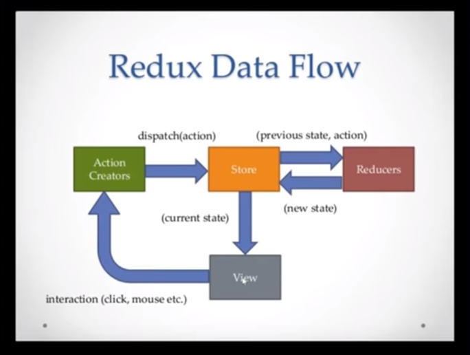

<link rel="stylesheet" href="slides.css">

# REDUX #


<!-- ||||||||||||||||||||||||||||||||||||||||||||||||||||||||||||| -->
<!-- ||||||||||||||||||||||||||||||||||||||||||||||||||||||||||||| -->
<!-- ||||||||||||||||||||||||||||||||||||||||||||||||||||||||||||| -->
<!-- ||||||||||||||||||||||||||||||||||||||||||||||||||||||||||||| -->
<!-- ||||||||||||||||||||||||||||||||||||||||||||||||||||||||||||| -->

<!-- todo #233 -->

<!-- todo #190 -->

<!-- todo #191 -->

<!-- todo #192 -->

<!-- todo #193 -->

<!-- ||||||||||||||||||||||||||||||||||||||||||||||||||||||||||||| -->
<!-- ||||||||||||||||||||||||||||||||||||||||||||||||||||||||||||| -->
<!-- ||||||||||||||||||||||||||||||||||||||||||||||||||||||||||||| -->
<!-- ||||||||||||||||||||||||||||||||||||||||||||||||||||||||||||| -->
<!-- ||||||||||||||||||||||||||||||||||||||||||||||||||||||||||||| -->

<section class="page">

<!-- ||||||||||||||||||||||||||||||||||||||||||||||||||||||||||||| -->

<article>

## GETTING STARTED ##

[#REDUX > IDEA](#redux--idea)

[REDUX IM DETAIL](#redux-im-detail)

[DATA FLOW](#data-flow)

[STARTING LINKS](#starting-links)

[STARTING TOOLS](#starting-tools)

[REDUX PRINCIPLES](#redux-principles)

[GETTING STARTED > LAB](#getting-started--lab)

[GETTING STARTED > EXERCISE](#getting-started--exercise)

---

</article>

<!-- ||||||||||||||||||||||||||||||||||||||||||||||||||||||||||||| -->

<article>

---

### #REDUX > IDEA ###

/ri'dʌks/

WAS IST REDUX

- JS-Bibliothek
- aktuelle Version 4.0.5 (24. Dez. 2019) / 4.0 (10. Juli 2019)   #checkForUpdates

WOZU IST REDUX

- Werkzeug zum verwalten vom Zustand einer Webanwendung (State Container)
- Zustand wird getrennt von den Komponenten verwaltet
- Insbesondere sinnvoll in komplexeren Anwendungen

<!-- todo #194 -->

</article>

<!-- todo #195 -->

<!-- ||||||||||||||||||||||||||||||||||||||||||||||||||||||||||||| -->

<article>

---

### REDUX IM DETAIL ###

Grundelemente von Redux

- state: Anwendungszustand
- action: Beschreibt eine Änderung am state
- action creator: Erzeugt eine action
- reducer: Führt einen state basierend auf einer action in einen nächsten state über
- store: Ort der Speicherung für state

<!-- todo #196 -->

</article>

<!-- ||||||||||||||||||||||||||||||||||||||||||||||||||||||||||||| -->

<article>

---

### DATA FLOW ###



</article>

<!-- ||||||||||||||||||||||||||||||||||||||||||||||||||||||||||||| -->

<article>

---

### STARTING LINKS ###

OFFICIAL HOMEPAGE

- https://redux.js.org 

OFFICIAL DOCS

- https://redux.js.org/introduction/getting-started
- https://redux.js.org/api/api-reference

OFFICIAL CODE

- https://github.com/reduxjs/redux

OFFICIAL BLOG

- kein

<!-- todo #197 -->

</article>

<!-- ||||||||||||||||||||||||||||||||||||||||||||||||||||||||||||| -->

<article>

---

### STARTING TOOLS ###

Redux Toolkit

- https://redux-toolkit.js.org/

Browser-Erweiterung Redux DevTools

- (ist aber nicht von Redux Team)

</article>

<!-- todo #198 -->

<!-- ||||||||||||||||||||||||||||||||||||||||||||||||||||||||||||| -->

<article>

---

### REDUX PRINCIPLES ###

GRUNDPRINZIPIEN VON REDUX

- Zustand (state) wird im globalen Objekt gespeichert
- Zustandsänderungen werden durch Actions ausgelöst, die die Zustandsänderung genau beschreiben
- Zustandsänderungen geschehen mittels Reducern, die einen Zustand in den nächsten überführen

<!-- todo #199 -->

</article>

<!-- todo #200 -->

<!-- ||||||||||||||||||||||||||||||||||||||||||||||||||||||||||||| -->

<article>

---

### GETTING STARTED > DEMO ###

Demo theory-app

- module80
- Wir erstellen einen Counter, der eine Zahl als Zustand hat und für den die zwei Actions increment und decrement definiert sind
- Die Reducer-Funktion erhält als Funktionsparameter den alten Zustand (State) und eine Action, die eine Zustandsänderung beschreibt.
- Die Reducer-Funktion gibt den neuen Zustand zurück.

Zentrales Element ist die Reducer-Funktion:

```js
// redux.js
const counter = (state = 0 /*initial state*/, action) => {
  switch (action.type) {
    case 'INCREMENT':
      return state + 1;
    case 'DECREMENT':
      return state - 1;
    default:
      return state;
  }
};
```

Store = Datenspeicher, der von einem Reducer verwaltet wird

```js
// redux.js
import { createStore } from 'redux';
// counter = reducer
const counterStore = createStore(counter);
```

Store verwenden

```js
counterStore.getState(); // 0
counterStore.dispatch({ type: 'INCREMENT' });
counterStore.getState(); // 1
```

<!-- todo #201 -->

</article>

<!-- ||||||||||||||||||||||||||||||||||||||||||||||||||||||||||||| -->

<article>

---

### GETTING STARTED > EXERCISE ###

- Erstelle einen neuen mathadorStore mit dem Ausgangszustand 1 und den Actions "Mal 3" und "Minus 7"
- Zusatzaufgabe: Erreiche den Zustand 4 durch das dispatchen passender Actions
- zweite Zusatzaufgabe: Erreiche den Zustand 10 durch das dispatchen passender Actions

</article>

<!-- ||||||||||||||||||||||||||||||||||||||||||||||||||||||||||||| -->

<article>

---

[zurück zum Ablauf]

</article>

</section>

<!-- ||||||||||||||||||||||||||||||||||||||||||||||||||||||||||||| -->
<!-- ||||||||||||||||||||||||||||||||||||||||||||||||||||||||||||| -->
<!-- ||||||||||||||||||||||||||||||||||||||||||||||||||||||||||||| -->
<!-- ||||||||||||||||||||||||||||||||||||||||||||||||||||||||||||| -->
<!-- ||||||||||||||||||||||||||||||||||||||||||||||||||||||||||||| -->

<section class="page">

<!-- ||||||||||||||||||||||||||||||||||||||||||||||||||||||||||||| -->

<article>

---

## STATE ##

[REDUX IM DETAIL - STATE](#redux-im-detail---state)

</article>

<!-- ||||||||||||||||||||||||||||||||||||||||||||||||||||||||||||| -->

<article>

---

### REDUX IM DETAIL - STATE ###

Beispiel: state

```js
{
  todos: [
    {description: 'laundry', completed: false, id: 0},
    {description: 'groceries', completed: true, id: 1},
    {description: 'taxes', completed: false, id: 2}
  ],
  filterText: ''
}
```

</article>

<!-- todo #202 -->

<!-- ||||||||||||||||||||||||||||||||||||||||||||||||||||||||||||| -->

<article>

---

[zurück zum Ablauf]

</article>

</section>

<!-- ||||||||||||||||||||||||||||||||||||||||||||||||||||||||||||| -->
<!-- ||||||||||||||||||||||||||||||||||||||||||||||||||||||||||||| -->
<!-- ||||||||||||||||||||||||||||||||||||||||||||||||||||||||||||| -->
<!-- ||||||||||||||||||||||||||||||||||||||||||||||||||||||||||||| -->
<!-- ||||||||||||||||||||||||||||||||||||||||||||||||||||||||||||| -->

<section class="page">

<!-- ||||||||||||||||||||||||||||||||||||||||||||||||||||||||||||| -->

<article>

---

## ACTIONS ##

[#ACTIONS > IDEA](#actions--idea)

</article>

<!-- ||||||||||||||||||||||||||||||||||||||||||||||||||||||||||||| -->

<article>

---

### #ACTIONS > IDEA ###

- Beschreiben eine Zustandsänderung (describe what happend)
- Sind js-Objekte mit einer type-Property und optional beliebigen anderen Properties
- Die type-Property ist üblicherweise ein String, oft als Konstante in einem separaten Modul definiert

<!-- todo #203 -->

</article>

<!-- ||||||||||||||||||||||||||||||||||||||||||||||||||||||||||||| -->

<article>

---

### REDUX > ACTIONS ###

Beispiele

```js
{ type: 'ADD_TODO', description: 'Build my first redux app' }
// oder
import { ADD_TODO } from './constants';
{ type: ADD_TODO, description: 'Build my first redux app' }
// oder
{
  type: 'TOGGLE_TODO',
  id: 2
}
```

</article>

<!-- ||||||||||||||||||||||||||||||||||||||||||||||||||||||||||||| -->

<article>

---

### REDUX > ACTIONS > ACTION CREATORS ###

Action creators sind meist sehr einfache Funktionen, die eine bestimmte Action erstellen

```js
const addTodo = (description, done = false) => ({
  type: ADD_TODO,
  description,
  done,
});
```

<!-- todo #204 -->

</article>

<!-- ||||||||||||||||||||||||||||||||||||||||||||||||||||||||||||| -->

<article>

---

### REDUX > ACTIONS > DISPATCH ###

see REDUX STORE.DISPATCH(ACTION)

<!-- todo #205 -->

</article>

<!-- todo #206 -->

<!-- todo #207 -->

<!-- todo #208 -->

<!-- ||||||||||||||||||||||||||||||||||||||||||||||||||||||||||||| -->

<article>

---

[zurück zum Ablauf]

</article>

</section>

<!-- ||||||||||||||||||||||||||||||||||||||||||||||||||||||||||||| -->
<!-- ||||||||||||||||||||||||||||||||||||||||||||||||||||||||||||| -->
<!-- ||||||||||||||||||||||||||||||||||||||||||||||||||||||||||||| -->
<!-- ||||||||||||||||||||||||||||||||||||||||||||||||||||||||||||| -->
<!-- ||||||||||||||||||||||||||||||||||||||||||||||||||||||||||||| -->

<section class="page">

<!-- ||||||||||||||||||||||||||||||||||||||||||||||||||||||||||||| -->

<article>

---

## REDUCERS

[#REDUCERS > IDEA](#reducers--idea)

[COMBINE REDUCERS](#combine-reducers)

[SIDE EFFECTS](#side-effects)

</article>

<!-- ||||||||||||||||||||||||||||||||||||||||||||||||||||||||||||| -->

<article>

---

### #REDUCERS > IDEA ###

- Actions werden von reducer-Funktionen verarbeitet
- Reducer-Funktionen erhalten als Argumente den alten Zustand (State) und eine Action
- Reducer-Funktionen geben den neuen Zustand zurück
- wichtig: Reducer-Funktionen ändern das alte state-Objekt nicht ab, sondern erstellen ein neues (pure function)

<!-- todo #209 -->

</article>

<!-- todo #210 -->

<!-- todo #211 -->

<!-- ||||||||||||||||||||||||||||||||||||||||||||||||||||||||||||| -->

<article>

---

### COMBINE REDUCERS ###

```js
const rootReducer = combineReducers({
 a: counter,
 b: mathador,
});
const rootStore = createStore(rootReducer);
rootStore.getState(); // {a: 0, b: 1}

rootStore.dispatch({ type: 'INCREMENT' }); // {a: 1, b: 1}
```

</article>

<!-- ||||||||||||||||||||||||||||||||||||||||||||||||||||||||||||| -->

<article>

---

### SIDE EFFECTS ###

Note that a reducer is a pure function. It only computes the next state. It should be completely predictable: calling it with the same inputs many times should produce the same outputs. It shouldn't perform any side effects like API calls or router transitions. These should happen before an action is dispatched.

</article>

<!-- ||||||||||||||||||||||||||||||||||||||||||||||||||||||||||||| -->

<article>

---

[zurück zum Ablauf]

</article>

</section>

<!-- ||||||||||||||||||||||||||||||||||||||||||||||||||||||||||||| -->
<!-- ||||||||||||||||||||||||||||||||||||||||||||||||||||||||||||| -->
<!-- ||||||||||||||||||||||||||||||||||||||||||||||||||||||||||||| -->
<!-- ||||||||||||||||||||||||||||||||||||||||||||||||||||||||||||| -->
<!-- ||||||||||||||||||||||||||||||||||||||||||||||||||||||||||||| -->

<section class="page">

<!-- ||||||||||||||||||||||||||||||||||||||||||||||||||||||||||||| -->

<article>

## STORE

[#STORE > IDEA](#store--idea)

[FOREVER ALLONE](#forever-allone)

---

</article>

<!-- ||||||||||||||||||||||||||||||||||||||||||||||||||||||||||||| -->

<article>

---

### #STORE > IDEA ###

Store ist ein Objekt, das Actions und Reducers zusammenbringt

- hält den Zustand der Anwendung
- gewährt Zugang zum Zustand über store.getState()
- erlaubt Änderung vom Zustand über store.dispatch(action)
- registriert die Listener über store.subscribe(listener)
- trennt die Listener wieder ab über die Funktion, die von subscribe() zurückgegeben wird

```js
redux.createStore()
[store].getState()
[store].dispatch()
```

<!-- todo #212 -->

</article>

<!-- todo #213 -->

<!-- todo #214 -->

<!-- todo #215 -->

<!-- ||||||||||||||||||||||||||||||||||||||||||||||||||||||||||||| -->

<article>

---

### FOREVER ALLONE ###

WICHTIG

- nur ein Store pro Redux-App
- Datenlogik aufsplitten ? Komposition von Reducern

<!-- todo #216 -->

</article>

<!-- ||||||||||||||||||||||||||||||||||||||||||||||||||||||||||||| -->

<article>

---

[zurück zum Ablauf]

</article>

</section>

<!-- ||||||||||||||||||||||||||||||||||||||||||||||||||||||||||||| -->
<!-- ||||||||||||||||||||||||||||||||||||||||||||||||||||||||||||| -->
<!-- ||||||||||||||||||||||||||||||||||||||||||||||||||||||||||||| -->
<!-- ||||||||||||||||||||||||||||||||||||||||||||||||||||||||||||| -->
<!-- ||||||||||||||||||||||||||||||||||||||||||||||||||||||||||||| -->

<section class="page">

<!-- ||||||||||||||||||||||||||||||||||||||||||||||||||||||||||||| -->

<article>

## DATA LIFECYCLE ##

---

[#DATA LIFECYCLE > IDEA](#data-lifecycle--idea)

</article>

<!-- ||||||||||||||||||||||||||||||||||||||||||||||||||||||||||||| -->

<article>

---

### #DATA LIFECYCLE > IDEA ###

4 Etappen im Lebenszyklus von Daten

- store.dispatch(action)
- store ruft die Reducer-Funktion auf
- Kombinieren die Rückgabe von mehreren Reducern im allgemeinen State-Baum
- Redux Store speichert den kompletten State-Baum, nachdem er den vom Root-Reducer bekommen hat

<!-- todo #217 -->

</article>

<!-- ||||||||||||||||||||||||||||||||||||||||||||||||||||||||||||| -->

<article>

---

[zurück zum Ablauf]

</article>

</section>

<!-- ||||||||||||||||||||||||||||||||||||||||||||||||||||||||||||| -->
<!-- ||||||||||||||||||||||||||||||||||||||||||||||||||||||||||||| -->
<!-- ||||||||||||||||||||||||||||||||||||||||||||||||||||||||||||| -->
<!-- ||||||||||||||||||||||||||||||||||||||||||||||||||||||||||||| -->
<!-- ||||||||||||||||||||||||||||||||||||||||||||||||||||||||||||| -->

<!-- <section class="page"> -->

<!-- ||||||||||||||||||||||||||||||||||||||||||||||||||||||||||||| -->

<!-- <article>

## SELECTORS ##

work in progress

---

</article> -->

<!-- todo #218 -->

<!-- ||||||||||||||||||||||||||||||||||||||||||||||||||||||||||||| -->

<!-- <article>

---

[zurück zum Ablauf]

</article>

</section> -->

<!-- ||||||||||||||||||||||||||||||||||||||||||||||||||||||||||||| -->
<!-- ||||||||||||||||||||||||||||||||||||||||||||||||||||||||||||| -->
<!-- ||||||||||||||||||||||||||||||||||||||||||||||||||||||||||||| -->
<!-- ||||||||||||||||||||||||||||||||||||||||||||||||||||||||||||| -->
<!-- ||||||||||||||||||||||||||||||||||||||||||||||||||||||||||||| -->

<section class="page">

<!-- ||||||||||||||||||||||||||||||||||||||||||||||||||||||||||||| -->

<article>

---

## REACT-REDUX

[#REACT-REDUX > IDEA](#react-redux--idea)

[#COMPONENTS > IDEA](#components--idea)

[#PROVIDER > IDEA](#provider--idea)

[REACT-REDUX > LAB](#react-redux--lab)

</article>

<!-- ||||||||||||||||||||||||||||||||||||||||||||||||||||||||||||| -->

<article>

---

### #REACT-REDUX > IDEA ###

WAS IST REACT-REDUX

- Official React bindings for Redux
- atkuelle version 7.2.0

WOZU IST REACT-REDUX

- installiert React Bindings

https://redux.js.org/basics/usage-with-react
https://react-redux.js.org/
https://github.com/reduxjs/react-redux

Setup im leeren Ordner:

```bash
npm init -y
npm install react redux
npm install --save react-redux
```

<!-- todo #219 -->

</article>

<!-- ||||||||||||||||||||||||||||||||||||||||||||||||||||||||||||| -->

<article>

---

### #COMPONENTS > IDEA ###

- Präsentationskomponenten / Komponenten
  - normale React-Komponenten, wieder verwendbar

- Container-Komponenten / Container
  - React-Kompoenten mit Zugriff auf Redux-Store (store.subscribe())

<!-- todo #220 -->

</article>

<!-- todo #221 -->

<!-- todo #222 -->

<!-- ||||||||||||||||||||||||||||||||||||||||||||||||||||||||||||| -->

<article>

---

### #PROVIDER > IDEA ###

Über Provider wird Redux-Store zu einer React-App angeschlossen

```js
// index.js
import { Provider } from 'react-redux';
// [...]
ReactDOM.render(
 <Provider store={myStore}>
  <App/>
 </Provider>
);
```

<!-- todo #223 -->

</article>


<!-- ||||||||||||||||||||||||||||||||||||||||||||||||||||||||||||| -->

<article>

---

### REACT-REDUX > CONNECT ###

connect: verbindet React-Komponenten mit dem Redux store

- mapStateToProps: verbindet React props mit Redux state
- mapDispatchToProps: verbindet React props mit Redux actions

Aufruf:

```js
component = connect(mapStateToProps, mapDispatchToProps)(
component
);
```

<!-- todo #224 -->

```js
import { connect } from 'react-redux';
function mapStateToProps(state) {
return { count: state };
}
// [...]
 <div className="App">
  {JSON.stringify(this.props)}
 </div>
// [...]
export default connect(mapStateToProps)(App);
```

</article>

<!-- todo #225 -->

<!-- todo #226 -->

<!-- ||||||||||||||||||||||||||||||||||||||||||||||||||||||||||||| -->

<article>

---

### REACT-REDUX > LAB ###

<!-- todo #227 -->

</article>

<!-- ||||||||||||||||||||||||||||||||||||||||||||||||||||||||||||| -->

<article>

---

[zurück zum Ablauf]

</article>

</section>

<!-- ||||||||||||||||||||||||||||||||||||||||||||||||||||||||||||| -->
<!-- ||||||||||||||||||||||||||||||||||||||||||||||||||||||||||||| -->
<!-- ||||||||||||||||||||||||||||||||||||||||||||||||||||||||||||| -->
<!-- ||||||||||||||||||||||||||||||||||||||||||||||||||||||||||||| -->
<!-- ||||||||||||||||||||||||||||||||||||||||||||||||||||||||||||| -->

<!-- <section class="page"> -->

<!-- ||||||||||||||||||||||||||||||||||||||||||||||||||||||||||||| -->

<!-- <article>

## MIDDLEWARE ##

---

</article> -->

<!-- todo #228 -->

<!-- todo #229 -->

<!-- todo #230 -->

<!-- todo #231 -->

<!-- todo #232 -->

<!-- ||||||||||||||||||||||||||||||||||||||||||||||||||||||||||||| -->

<!-- <article>

---

[zurück zum Ablauf]

</article>

</section> -->

<!-- ||||||||||||||||||||||||||||||||||||||||||||||||||||||||||||| -->
<!-- ||||||||||||||||||||||||||||||||||||||||||||||||||||||||||||| -->
<!-- ||||||||||||||||||||||||||||||||||||||||||||||||||||||||||||| -->
<!-- ||||||||||||||||||||||||||||||||||||||||||||||||||||||||||||| -->
<!-- ||||||||||||||||||||||||||||||||||||||||||||||||||||||||||||| -->

<section class="page">

<!-- ||||||||||||||||||||||||||||||||||||||||||||||||||||||||||||| -->

<article>

---

## REDUX TOOLKIT

[#REDUX-TOOLKIT > IDEA](#redux-toolkit--idea)

</article>

<!-- ||||||||||||||||||||||||||||||||||||||||||||||||||||||||||||| -->

<article>

---

### #REDUX-TOOLKIT > IDEA ###

https://redux-toolkit.js.org/

</article>

<!-- ||||||||||||||||||||||||||||||||||||||||||||||||||||||||||||| -->

<article>

---

[zurück zum Ablauf]

</article>

</section>
